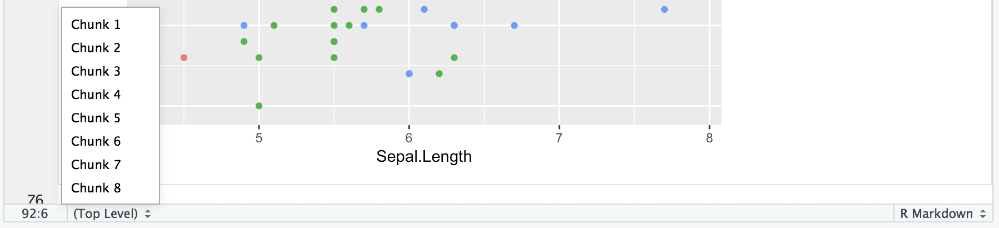

# Iris Example {#iris}

This example goes through some work with the `iris` dataset. Includes info about viewing data, plotting with ggplot, markdown, and more.

## Viewing Data

Let's start with loading the package so we can get the data as a dataframe.
```{r import_data}
library(datasets)

class(iris)
```

This is not a huge dataset, but it is helpful to get into the habit of treating datasets as large no matter what. Because of this, make sure you inspect the size and structure of your dataset before going and printing it to the console. 

Here we can see that we have 150 observations across 5 different variables.
```{r dim_view}
dim(iris)
```

There are a bunch of ways to get information on your dataset. Here are a few:
```{r other_views, message=FALSE}
str(iris)

summary(iris)

# This one requires dplyr, but it's worth it :)
library(dplyr)
glimpse(iris)
```

Plotting the data by calling `iris` to the console will print the whole thing. Go ahead and try it in this case, but this is not recommended for larger datasets. Instead, use `head()` in the console or `View()`.

If you want to learn more about these commands, or anything for that matter, just type `?<command>` into the console. `?head`, for example, will reveal that there is an additional argument to `head` called `n` for the number of lines printed, which defaults to 6. Also, you may notice there is something called `tail`. I wonder what that does? :)

## Plotting data

Let's plot something!
```{r blank_plot}
# Something's missing
library(ggplot2)
ggplot(iris)
```

Where is it? Maybe if I add some aesthetics. I remember that was an important word that came up somewhere:
```{r blank_plot_aes}
# Still not working...
ggplot(data = iris, mapping = aes(x = Sepal.Length, y = Sepal.Width))
```

Still nothing. I have to add a geom for something to show up.
```{r first_ggplot}
# There we go!
ggplot(data = iris, mapping = aes(x = Sepal.Length, y = Sepal.Width)) +
  geom_point()
```

Yay! Something showed up! Notice where we put the `data`, inside of `ggplot()`. ggplot is built on layers. Here we put it in the main call to `ggplot`. The `data` argument is also available in `geom_point()`, but in that case it would only apply to that layer. Here, we are saying, for all layers, unless specified otherwise, make the `data` be `iris`.

Now let's add a color mapping by `Species`:
```{r ggplot_colored}
ggplot(data = iris, mapping = aes(x = Sepal.Length, y = Sepal.Width)) +
  geom_point(aes(color = Species))
```

Usually it is helpful to store the main portion of the plot in a variable and add on the layers. The code below achieves the same output as above:
```{r ggplot_color_and_variables, eval = FALSE}
sepal_plot <- ggplot(data = iris, mapping = aes(x = Sepal.Length, y = Sepal.Width))

sepal_plot + 
  geom_point(aes(color = Species))
```

## Markdown Etiquette

Working with markdown and chunks can get out of hand, but there are some helpful tricks. First, consider naming your chunks as you go. If you combine this with headers, your work will be much more organized. Specifically, the little line at the bottom of the editor becomes much more useful.

From this:


To this:


Just add a name to the start of each chunk:
`{r <cool-code-chunk-name>, <chunk_option> = TRUE}`

Now you can see what the chunks were about as well as get a sense of where you are in the document. Just don't forget, it is a space after the `r` and commas for the other chunk options like `eval` or `echo`.

## Overlapping Data

Eagle-eyed viewers may notice that we seem to be a few points short. We should be seeing 150 points, but we only see 117 (yes, I counted). Where are those missing points? They are actually hiding behind other points. This dataset rounds to the nearest tenth of a centimeter, which is what is giving us those regular placings of the points. How did I know the data was in centimeters? `?iris` of course! [Ah, you ask a silly question, you get a silly answer](https://youtu.be/UIKGV2cTgqA?t=3m9s).

```{r overlapping_data_repeated, eval = FALSE}
# This plot hides some of the points
ggplot(data = iris, mapping = aes(x = Sepal.Length, y = Sepal.Width)) + 
  geom_point(aes(color = Species))
```

What's the culprit? The `color` aesthetic. The color by default is opaque and will hide any points that are behind it. As a rule, it is always beneficial to reduce the opacity a little no matter what to avoid this problem. To do this, change the `alpha` value to something other than it's default `1`, like `0.5`. 

```{r overlap_alpha}
ggplot(data = iris, mapping = aes(x = Sepal.Length, y = Sepal.Width)) + 
  geom_point(aes(color = Species, alpha = 0.5))
```

Okay...a couple things with this. 

First, did you notice the new addition to the legend? That looks silly! Why did that show up? Well, when we added the `alpha` into `aes()`. Specifically, this is saying:

`geom_point(mapping = aes(color = Species, alpha = 0.5))`

So, we are mapping these given *aesthetics*, `color` and `alpha`, to certain values. ggplot knows that usually the aesthetic mapping will vary since you are probably passing in data that varies, so it will create a legend for each mapping. However, we don't need a legend for the `alpha`: we explicitly set it to be 0.5. To fix this, we can pull `alpha` out of `aes` and instead treat it like an *attribute*:

```{r overlap_alpha_fix1}
ggplot(data = iris, mapping = aes(x = Sepal.Length, y = Sepal.Width)) + 
  geom_point(aes(color = Species), alpha = 0.5)
```

No more legend. So, in ggplot, there is a difference between where an aesthetic is placed. It is also called MAPPING an aesthetic (making it vary with data inside `aes`) or SETTING an aesthetic (make it a constant attribute across all datapoints outside of `aes`).

Second thing: still can't really see the data
  Problem with overlap and need jitter
  
Showing when jitter is needed

## Formatting for prez

Adding titles/labels

## Helpful links

Mapping aesthetics to things in ggplot datacamp

Markdown code chunks 

rfds


