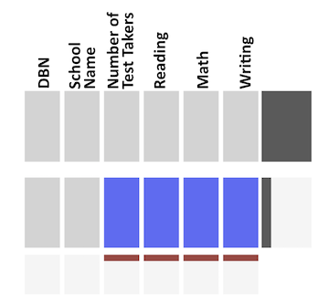

GR5702 Test 2 Sample Questions
================

<strong>NOTES:

* The actual test will contain 25 multiple questions.

* It is not cumulative.

* The style of the coding questions will be similar to these questions. That is, the focus will be on understanding concepts and being able to read D3 code, rather than syntax.

</strong>


### Questions

1) The data frame `schooldata` contains 349 rows of data (1 row per school) and 6 columns: `DBN`, `School Name`, `Number of Test Takers`, `Reading`, `Math`, and `Writing`. A graph of missing values was produced as follows:

`> extracat::visna(schooldata)`



Based on the graph, which of the following is a true statement?

*a*) There is no missing data.

*b*) All rows are missing data for `Number of Test Takers`, `Reading`, `Math`, and `Writing`.

*c*) Each of the columns, `Number of Test Takers`, `Reading`, `Math`, and `Writing`, is missing the same number of data values, but we cannot tell if the missing data is in the same rows or different rows.

*d*) About 80% of the rows are not missing any data, and about 20% are missing all of the following: `Number of Test Takers`, `Reading`, `Math`, and `Writing`.

<br>

2) In the cartogram below, land area is adjusted to be proportional to \_\_\_\_\_\_\_\_\_.


<br>

*a*) ratio of Democratic to Republican voters

*b*) number of voters

*c*) population density

*d*) share of Democratic voters

<br>

*Note: unless specified otherwise, assume that JavaScript code chunks are run as scripts (not line by line in the console).*

<br>


3) D3 selection methods, `d3.select()` and `d3.selectAll()`, can be used:

<br>

**I**. to select SVG graphical elements

**II**. to select HTML nodes

<br> 

*a*) I only

*b*) II only

*c*) I & II

*d*) neither I nor II

<br>

4) Given:

**DOM SVG**

``` svg
<circle cx="50" cy="100" r="10" fill="blue"></circle>
  <g>
    <circle cx="100" cy="100" r="10" fill="blue"></circle>
    <circle cx="150" cy="100" r="10" fill="blue"></circle>
    <circle cx="200" cy="100" r="10" fill="blue"></circle>
  </g>
<circle cx="250" cy="100" r="10" fill="blue"></circle>
```

Which of the following represents the *enter selection* returned by:

`> d3.select("g").selectAll("circle").data([10, 23, 42, 15, 18]).enter();`

*a*) `[empty × 3, q, q]`

*b*) `[empty × 4, q]`

*c*) `[empty × 5]`

*d*) `[q, q, q, q, q]`

<br>

5) Given the same DOM SVG as in the previous question, `d3.select("circle").remove()` will remove the circle with which `cx` value?

*a*) 50

*b*) 100

*c*) 200

*d*) 250

<br>

6) Given:

**DOM SVG**

``` svg
  <text x="250" y="200">hello</text>
```

**JavaScript**

``` js
  d3.select("svg").on("click", function()
  {d3.select("text").text(`(${d3.mouse(this)})`)});
```

What will be the value of the text element after clicking on the SVG?

*a*) `this`

*b*) `hello`

*c*) `(`*x, y*`)` *(where x & y are the coordinates of the mouse click position on the SVG)*

*d*) `(250, 200)`

<br>

7) Fill in the blanks to make a true statement.

When passed a \_\_\_\_\_\_\_\_, the D3 axis component `d3.axisTop()` \_\_\_\_\_\_\_\_\_\_\_\_\_\_\_\_\_\_\_\_.

*a*) selection / creates SVG axis elements.

*b*) selection / constructs an axis generator.

*c*) scale / creates SVG axis elements.

*d*) scale / constructs an axis generator.

<br>

8) Given:

**JavaScript**

``` js
xScale = d3.scaleBand()
    .domain(["yes", "no", "maybe"])
    .range([0, 300]);
```

What will be returned if

`> xScale("no")`

is executed in the console?

*a*) `0`

*b*) `100`

*c*) `200`

*d*) `300`

<br>

9) In D3, the default coordinates for an axis appended to an SVG of width 500 and height 400 are:

*a*) `(0, 0)`

*b*) `(0, 400)`

*c*) `(500, 400)`

*d*) `(500, 0)`

<br>

10) Given:

**DOM SVG**

``` svg
<circle></circle>
```

Which of the following will **not** add an SVG circle to the DOM?

*a*) `d3.select("svg").append("circle");`

*b*) `d3.select("svg").selectAll("circle").data([7]).enter().append("circle");`

*c*) `d3.select("svg").selectAll("circle").data([7, 4]).enter().append("circle");`

*d*) `d3.select("svg").append("g").append("circle");`
