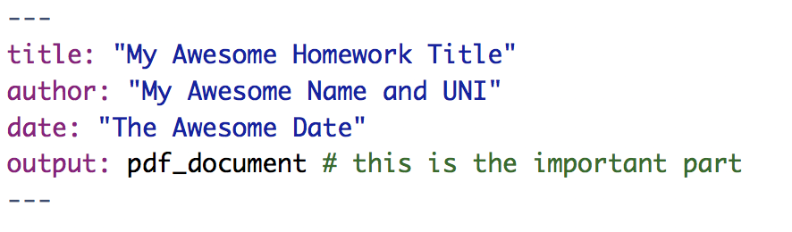
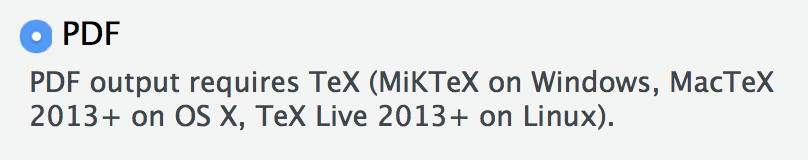

# R Basics {#basics} 


```{r, echo = FALSE}
package_num <- dim(available.packages(repos = "http://cloud.r-project.org/"))[1]
numpack <- floor(package_num / 100) * 100
```

So...there is soooo much to the world of R. Textbooks, cheatsheets, exercises, and other buzzwords full of resources you could go through. There are over `r format(numpack, scientific=FALSE)` packages on [CRAN](https://cran.r-project.org){target="_blank"}, the network through which R code and packages are distributed. It can be overwhelming.  However, bear in mind that R is being used for a lot of different things, not all of which are relevant to EDAV. 

To help you navigate the landscape, here we provide a collection of resources that you should be familiar with in the context of this course. This is not to say that any of these resources are prerequisites, but they will come up in the course and we want to give you places to learn about them.

Since people come with a variety of backgrounds, we'll try to provide the essentials as well as some resources for more advanced users. Do not feel you have to go through all of these resources, but know that they are here if/when you need them. <i class="far fa-smile-beam"></i>

## Essentials checklist

In an effort to get everyone on the same page, here is a checklist of essentials so you can get up and running with this course. It will echo/reference a lot of info said below, but we want to make sure everything mentioned is clear and understood.

Okay, then. Here are the essentials, in checklist form:

### Learn R

1. **Download R and RStudio**: This is the biggest thing to do by far. Make sure to download *both* R and RStudio, as mentioned in [Setting up R and RStudio](#setting-up-r-and-rstudio).
2. **Learn your way around RStudio**: RStudio is powerful...if you know how to use it. Take the time to look through the [DataCamp sections on the RStudio IDE](https://www.datacamp.com/courses/working-with-the-rstudio-ide-part-1){target="_blank"} so you feel comfortable (see [Use RStudio like a pro](#use-rstudio-like-a-pro) section).
3. **Try something!**: Getting comfortable with an IDE is all about practice. So while the DataCamp vids are great, don't solely rely on them. Try things out for yourself! Here are some things to play around with:
    - Create an R Script file, paste in `print("Hello, World!")`, and run it
    - Create an R Markdown file and have it generate an HTML page
    - Download some packages like `tidyverse` or `MASS`
    - Do some math in the console
4. **Study R**: See [Learning about R](#learning-about-r) below.
5. **Learn how to get help**: Make sure you are comfortable searching for answers when you get stuck. See the section below on [getting help](#getting-help) for some...help.


### Prepare for class

1. **Get the Textbook**: This course uses *Graphical Data Analysis with R* as its textbook. Here is an [Amazon link for a physical copy](https://www.amazon.com/Graphical-Data-Analysis-Chapman-Hall/dp/1498715230){target="_blank"} and a link to the [book's website](http://www.gradaanwr.net/){target="_blank"}. 
2. **Setup DataCamp Account**: A lot of the references and support materials discussed in edav.info/ are from [DataCamp](https://www.datacamp.com/){target="_blank"}, an online collection of courses/articles on data science. Some of the sections are free, but most are behind a paywall. However, DataCamp currently provides full access to the site for students with .edu email addresses. If you are enrolled in this course, during the first week of class you will receive an invitation to create an account using your columbia.edu email address, which will grant you full access. 

## Getting started

### Setting up R and RStudio

It is super important to get up and running with R and RStudio as soon as you can.
```{r}
latest_version <- xml2::read_html("https://cran.r-project.org/bin/macosx/") %>% 
    rvest::html_node("body") %>% 
    rvest::html_node("h2") %>% 
    rvest::html_text()
```


If you already installed R, make sure you're current! The latest version of R is `r latest_version`.

* [This video](https://campus.datacamp.com/courses/working-with-the-rstudio-ide-part-1/orientation?ex=3){target="_blank"} from DataCamp pretty much covers it. Know that you will be downloading two separate things: [R](https://cran.r-project.org/){target="_blank"}, which is a programming language; and [RStudio](https://www.rstudio.com/download/){target="_blank"}, which is an IDE (integrated development environment...fancy tool for working with R) that will make working with R a lot more enjoyable.

### Use RStudio like a pro

Great! RStudio is up and running on your computer! Now make sure you get comfy with what it can do.

* **Don't know your way around the RStudio IDE?** I highly recommend [this DataCamp course](https://www.datacamp.com/courses/working-with-the-rstudio-ide-part-1){target="_blank"}. Sections from Part 1 (Orientation, Programming, and Projects) are the most relevant for this course. They include videos about all the regions in RStudio, how to program efficiently/effectively in the IDE (gotta love those keyboard shortcuts), and the benefits of setting up R projects. A little hazy on that last sentence? The course will help.

* **Just want a quick reference to brush up with?** Take a look at the [RStudio Cheatsheets page](https://www.rstudio.com/resources/cheatsheets/){target="_blank"}. Another option [is this RStudio webinar](https://www.rstudio.com/resources/webinars/rstudio-essentials-webinar-series-part-1/){target="_blank"}. 

* **Want to make the RStudio IDE your own?** Look into [modifying the preferences](https://support.rstudio.com/hc/en-us/articles/200549016-Customizing-RStudio){target="_blank"}. You can customize the look of the IDE like default colors and typefaces, tweak default behaviors like clearing the environment on load, and integrate a session with a git repository. If something about the IDE bugs you, chances are you can make it more to your liking.

### Learning about R

R is just like any language, programming or otherwise: you need to *use* it to get *used* to it.

* **Just starting out in R?** Check out this free [DataCamp course](https://www.datacamp.com/courses/free-introduction-to-r){target="_blank"} for a quick introduction. For this course, you can skim/mostly ignore matrices and lists (Parts 3 & 6).

* Next cover the material in the first section of [R for Data Science](http://r4ds.had.co.nz){target="_blank"} It is based on the tidyverse, a group of packages which, among other things, make it easier to code in R:
    - [Data Visualization](http://r4ds.had.co.nz/data-visualisation.html){target="_blank"}
    - [Workflow: basics](http://r4ds.had.co.nz/workflow-basics.html){target="_blank"}
    - [Data transformation](http://r4ds.had.co.nz/transform.html){target="_blank"}
    - [Workflow: scripts](http://r4ds.had.co.nz/workflow-scripts.html){target="_blank"}
    - [Exploratory Data Analysis](http://r4ds.had.co.nz/exploratory-data-analysis.html){target="_blank"}
    - [Workflow: projects](http://r4ds.had.co.nz/workflow-projects.html){target="_blank"}
    
General advice: don't get caught up in the details.  Keep a list of questions and move on. 

## Packages and imports

### Installing packages

A lot of the cool stuff comes from installing packages into R. 

* **How do you install packages?** The main function we use is `install.packages("<package_name>")`, which installs from [CRAN](https://cran.r-project.org){target="_blank"}, a well-known place where packages are stored. Then, once installed, you can use packages by calling them within `library()`. 

* **Still confused?** [This DataCamp video](https://campus.datacamp.com/courses/intermediate-r/chapter-3-functions?ex=16){target="_blank"} should help explain the process. Also be sure to try the [accompanying exercise](https://campus.datacamp.com/courses/intermediate-r/chapter-3-functions?ex=17){target="_blank"} to make sure you have a feel for loading a package.

* **Want more info?** Check out this [DataCamp article on everything about installing packages in R](https://www.datacamp.com/community/tutorials/r-packages-guide){target="_blank"}. As well as covering the basics, this article shows you how to install packages that are not located on CRAN using `devtools`, as well as ways to monitor the status/health of your installed packages.

### Tidyverse

Don't know what the [tidyverse](https://www.tidyverse.org/){target="_blank"} is? It's great and we use it throughout this course. Specifically, `ggplot2` and `dplyr`, two packages within the Tidyverse. 

* **What's ggplot?** Check out [this DataCamp course](https://www.datacamp.com/courses/data-visualization-with-ggplot2-1){target="_blank"}. This course is split up into three parts and it is quite long, but it does go over pretty much everything ggplot has to offer. If you are starting out, stick with [Part 1](https://www.datacamp.com/courses/data-visualization-with-ggplot2-1){target="_blank"}.

* **What's dplyr?** Make friends with [this DataCamp course](https://www.datacamp.com/courses/dplyr-data-manipulation-r-tutorial){target="_blank"}. It goes through the main dplyr verbs: select, mutate, filter, arrange, summarise; as well as the [lovely pipe operator](https://www.datacamp.com/community/tutorials/pipe-r-tutorial){target="_blank"}.<br> Check out these [super cool animations](https://github.com/gadenbuie/tidyexplain){target="_blank"}, which depict a data frame as it is transformed by `dplyr` and `tidyr` functions (a great application of `gganimate`!)

* **Want case studies to go through?** Try [this one](https://campus.datacamp.com/courses/data-visualization-with-ggplot2-2/chapter-5-case-study?ex=1){target="_blank"} or [this one](https://campus.datacamp.com/courses/data-visualization-with-ggplot2-part-3/data-munging-and-visualization-case-study?ex=1){target="_blank"}.

### Importing data

We often will need to pull data into RStudio to work with it. 

* **"Pull data"? I'm already confused.** But wait! Here's a [DataCamp course on importing data](https://www.datacamp.com/courses/importing-data-in-r-part-1){target="_blank"}. **Note**: This course explains how to import every kind of data format under the sun...all you need to be familiar with for this course (mostly) is pulling in CSV files using `read_csv`. So, if you are overwhelmed, just stick to the [read_csv stuff](https://r4ds.had.co.nz/data-import.html){target="_blank"}.

* **Importing every data format under the sun you say?** I want to know how to do that. Here's [Part 1](https://www.datacamp.com/courses/importing-data-in-r-part-1){target="_blank"}, as well as [Part 2](https://www.datacamp.com/courses/importing-data-in-r-part-2){target="_blank"}, which focuses on databases and HTTP requests. Go nuts.

## Communicating Results

### R Markdown & Knitr

R Markdown is how you will be writing assignments for this course and Knitr is how you will generate an output file for submission. In general, they're a great way to communicate your findings to others (for the python-lovers among you, this is the [Jupyter Notebook](http://jupyter.org/){target="_blank"} of the R world).

* **Want to jump right in?** Open a new R Markdown file (*File > New File > R Markdown...*), and set its `Default Output Format` to `HTML`. You will get a R Markdown template you can tinker with. Try knitting the document to see what everything does. For more info on what is happening behind the scenes, checkout this [R Markdown Quick Tour](https://rmarkdown.rstudio.com/authoring_quick_tour.html){target="_blank"}.

* **Want a simple description of R Markdown?** Checkout [this RStudio article](https://rmarkdown.rstudio.com/articles_intro.html){target="_blank"} for a description on how to combine text, source code, and output into one document.

* **Prefer videos?** [DataCamp course](https://www.datacamp.com/courses/reporting-with-r-markdown){target="_blank"} to the rescue! There is also an [RStudio webinar](https://www.rstudio.com/resources/webinars/getting-started-with-r- markdown/){target="_blank"} about it.

* **Don't know about Knitr?** Here's [the specific section on Knitr](https://campus.datacamp.com/courses/reporting-with-r-markdown/chapter-two-embedding-code?ex=1){target="_blank"} from the DataCamp course cited above. With this package, you can embed code directly into your R Markdown files and generate output documents. Make sure to go through the later exercises to learn about [code chunks](https://rmarkdown.rstudio.com/lesson-3.html){target="_blank"} and [chunk options](http://yihui.name/knitr/options/){target="_blank"} so you can fine-tune your final output document with ease.

* **Wondering what chunk options are?** Have you ever wanted to align graphs in your output PDF differently? Or re-size a plot in your output document? Or suppress an annoying message a package raises? Chunk options address this. We have made [an R Markdown file showing off different chunk options](https://github.com/jtr13/EDAV/blob/master/data/chunk_option_showcase.Rmd){target="_blank"} that you can download from our github repo and play around with. Also make sure to checkout [the documentation on chunk and package options](http://yihui.name/knitr/options/){target="_blank"} for a full list of what's possible.

* The [R Markdown page](https://rmarkdown.rstudio.com/){target="_blank"} from RStudio has [lessons](https://rmarkdown.rstudio.com/lesson-1.html){target="_blank"} with extensive info. Also, more cheatsheets.

### Submitting Assignments

Here's a quick run-down of how to submit your assignments using [R Markdown and Knitr](#r-markdown-knitr).

- **Create R Markdown file with PDF output format**: We will often provide you with a template, and feel free to add on to it directly, but **make sure its output format is set to `pdf_document`**. Write out your explanations and insert code chunks to answer the questions provided. If you want to make a new file, go to *File > New File > R Markdown...* and set the `Default Output Format` to `PDF`. Either way, the header of the `.Rmd` file should look something like this:



- **Add PDF Dependencies**: As stated when you create a new R Markdown file, the PDF output format requires TeX:



- Make sure you download TeX for your machine. Here are some Medium articles on the process of creating PDF reports (the articles cover starting from scratch with no installs at all, but you can skip over to installing TeX only):
    + [**Mac OS**](https://medium.com/@sorenlind/create-pdf-reports-using-r-r-markdown-latex-and-knitr-on-macos-high-sierra-e7b5705c9fd){target="_blank"}
    + [**Windows**](https://medium.com/@sorenlind/create-pdf-reports-using-r-r-markdown-latex-and-knitr-on-windows-10-952b0c48bfa9){target="_blank"}

This can be a little complicated, but it will make that Knit button near the top of the IDE magically generate a PDF for you. 

If you are in a rush and want a shortcut, you can instead set the `Default Output Format` to `HTML`. When you open the file in your browser, you can save it as a PDF. It will not be as nicely formatted, but it will still work.

## Getting help


*via [https://dev.to/rly](https://dev.to/rly){target="_blank"}*

First off...breeeeeeathe. We can fix this. There are a bunch of resources out there that can help you.

### Things to try

* Remember: Always try to help yourself! [This article](https://www.r-project.org/help.html){target="_blank"} has a great list of tools to help you learn about anything you may be confused by. This includes learning about functions and packages as well as searching for info about a function/package/problem/etc. This is the perfect place to learn how to get the info you need.

* The RStudio Help menu (in the top toolbar) is a fantastic place to go for understanding/fixing any problems. There are links to documentation and manuals as well as cheatsheets and a lovely collection of keyboard shortcuts.

* Vignettes are a great way to learn about packages and how they work. Vignettes are like stylized manuals that can do a better job at explaining a package's contents. For example, `ggplot2` has a vignette on aesthetics called `ggplot2-specs` that talks about different ways you can map data to different formats.
    + Typing `browseVignettes()` in the console will show you all the vignettes for all of the packages you have installed.
    + You can also see vignettes by package by typing `vignette(package = "<package_name>")` into the console.
    + To run a specific vignette, use `vignette("<vignette_name>")`. If the vignette can't be resolved, include the package name as well: `vignette("<vignette_name", package = "<package_name>")`
    
* Don't ignore errors. They are telling you so much! If you give up because red text showed up in your console, take the time to see what that red text is *saying*. Learn [how to read errors](http://www.dummies.com/programming/r/how-to-read-errors-and-warnings-in-r/){target="_blank"} and [what they are telling you](https://campus.datacamp.com/courses/working-with-the-rstudio-ide-part-1/programming?ex=18){target="_blank"}. They usually include where the problem happened and what R thinks the problem stems from. 

*More Advanced*: Learn to love debugger mode. Debugging can have a steep learning curve, but huge payoffs. Take a look at these videos about [debugging with R](https://campus.datacamp.com/courses/working-with-the-rstudio-ide-part-1/programming?ex=20){target="_blank"}. Topics include running the debugger, setting breakpoints, customizing preferences, and more. **Note**: R Markdown files have some limitations for debugging, as discussed in [this article](https://support.rstudio.com/hc/en-us/articles/205612627-Debugging-with-RStudio#debugging-in-r-markdown-documents){target="_blank"}. You could also consider working out your code in a `.R` file before including it in your R Markdown homework submission.

### Help me, R community!

Relax. There are a bunch of people using the same tools you are.

* Your fellow classmates are a good place to start! Post questions to [Piazza](https://piazza.com/){target="_blank"} to see how they could help.

* There is a lot of great documentation on R and its functions/packages/etc. Get comfy with [R Documentation](https://www.rdocumentation.org/){target="_blank"} and it will help you immensely.

* There is a vibrant [RStudio Community page](https://community.rstudio.com/){target="_blank"}. Also, R likes twitter. Check out [#rstats](https://twitter.com/search?q=%23rstats){target="_blank"} or maybe [let Hadley Wickham know about a wonky error message](https://twitter.com/hadleywickham/status/952259891342794752){target="_blank"}.


