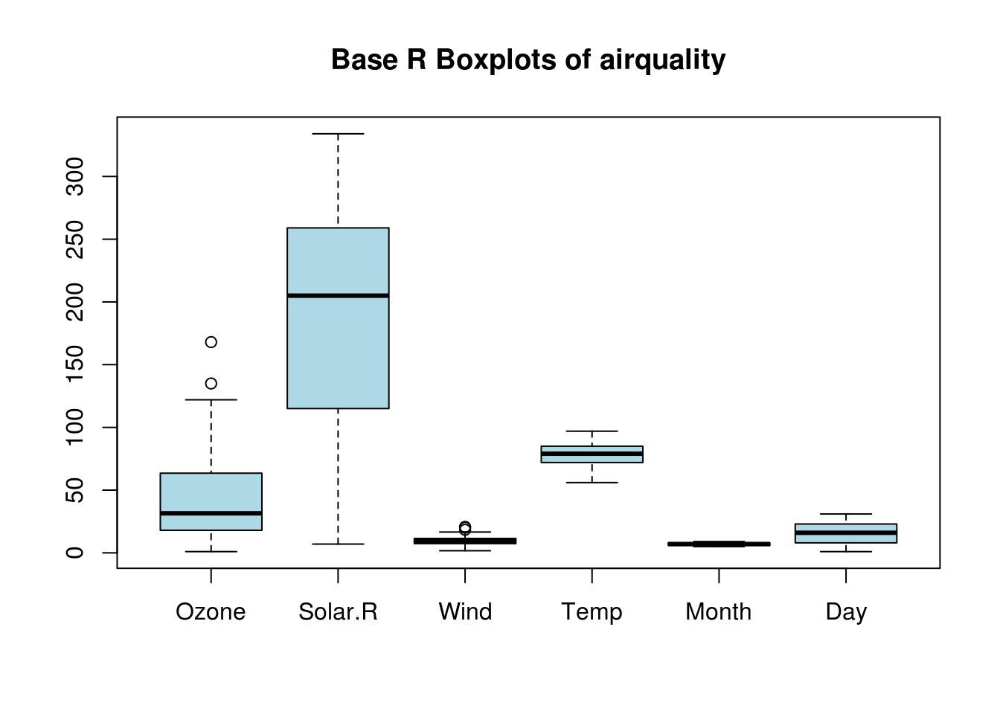
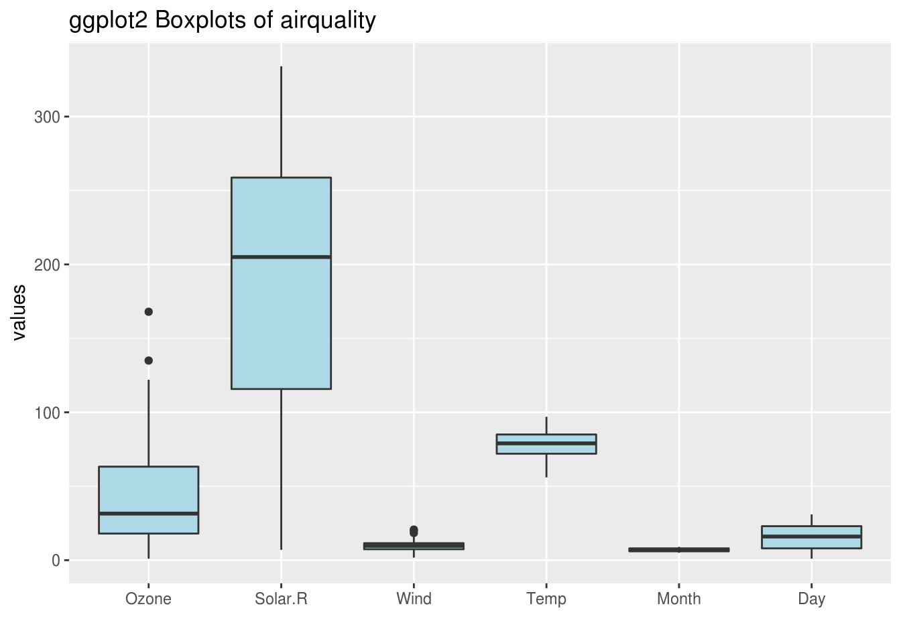
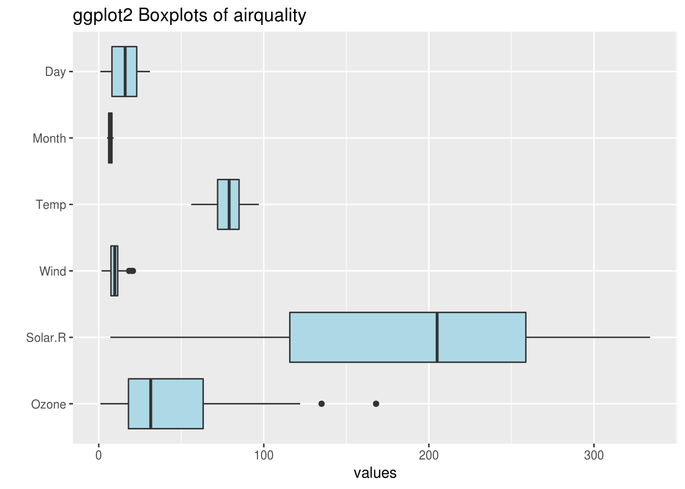
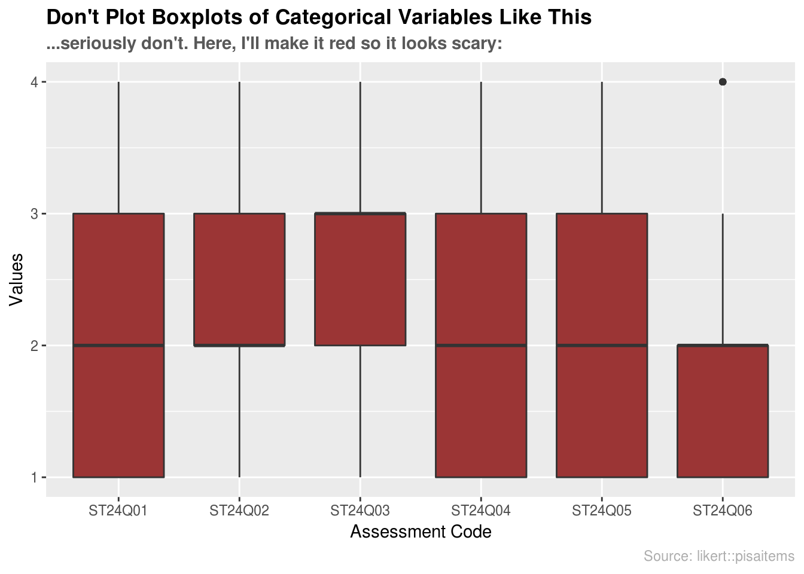

# Chart: Boxplot {#box}


## Overview

This section covers how to make boxplots.

## tl;dr
I want a nice example and I want it NOW!

Here's a look at the weights of newborn chicks split by the feed supplement they received:


And here's the code:

```r
library(datasets) # data
library(ggplot2) # plotting

# reorder supplements
supps <- c("horsebean", "linseed", "soybean", "meatmeal", "sunflower", "casein")

# boxplot by feed supplement with jitter layer
ggplot(chickwts, aes(x = factor(feed, levels = supps), 
                     y = weight)) + 
  # plotting
  geom_boxplot(fill = "#cc9a38", color = "#473e2c") + 
  geom_jitter(alpha = 0.2, width = 0.1, color = "#926d25") +
  # formatting
  ggtitle("Casein Makes You Fat?!",
          subtitle = "Boxplots of Chick Weights by Feed Supplement") +
  labs(x = "Feed Supplement", y = "Chick Weight (g)", caption = "Source: datasets::chickwts") +
  theme(plot.title = element_text(face = "bold")) +
  theme(plot.subtitle = element_text(face = "bold", color = "grey35")) +
  theme(plot.caption = element_text(color = "grey68"))
```

For more info on this dataset, type `?datasets::chickwts` into the console.

## Simple Examples
Okay...*much* simpler please.
 
Let's use the `airquality` dataset from the `datasets` package:

```r
library(datasets)
head(airquality, n = 5)
```

```
##   Ozone Solar.R Wind Temp Month Day
## 1    41     190  7.4   67     5   1
## 2    36     118  8.0   72     5   2
## 3    12     149 12.6   74     5   3
## 4    18     313 11.5   62     5   4
## 5    NA      NA 14.3   56     5   5
```

### Boxplot using Base R

```r
# plot data
boxplot(airquality, col = 'lightBlue', main = "Base R Boxplots of airquality")
```



Boxplots with Base R are super easy. Like [histograms](histogram.html), boxplots only need the data. In this case, we passed a dataframe with six variables, so it made separate boxplots for each variable. You may not want to create boxplots for every variable, in which case you could specify the variables individually or use [`filter`](https://www.rdocumentation.org/packages/dplyr/versions/0.7.5/topics/filter){target="_blank"} from the [`dplyr`](https://www.rdocumentation.org/packages/dplyr/versions/0.7.5){target="_blank"} package.

### Boxplot using ggplot2

```r
# import ggplot
library(ggplot2)

# plot data
g1 <- ggplot(stack(airquality), aes(x = ind, y = values)) + 
  geom_boxplot(fill = "lightBlue") +
  # extra formatting
  labs(x = "") +
  ggtitle("ggplot2 Boxplots of airquality")

g1
```

```
## Warning: Removed 44 rows containing non-finite values (stat_boxplot).
```



`ggplot2` requires data to be mapped to the `x` and `y` aesthetics. Here we use the `stack` function to combine each column of the `airquality` dataframe. Reading the documentation for the `stack` function (`?utils::stack`), we see the new stacked dataframe has two columns: `values` and `ind`, which we use to create the boxplots. **Notice**: `ggplot2` warns us that it is ignoring "non-finite values", which are the NA's in the dataset.

## When to use
Boxplots should be used to display *continuous variables*. They are particularly useful for identifying outliers and comparing different groups. 

*Aside*: Boxplots may even help you [convince someone you are their outlier](https://xkcd.com/539/){target="_blank"} (If you like it when people over-explain jokes, [here is why that comic is funny](https://www.explainxkcd.com/wiki/index.php/539:_Boyfriend){target="_blank"}.). 

## Considerations

### Flipping Orientation
Often you want boxplots to be horizontal. Super easy to do: just tack on `coord_flip()`:

```r
# g1 plot from above (5.3.2)
g1 + coord_flip()
```

```
## Warning: Removed 44 rows containing non-finite values (stat_boxplot).
```



### NOT for categorical data
Boxplots are great, but they do NOT work with categorical data. Make sure your variable is continuous before using boxplots. Here's an example of what *not* to do:

```r
library(likert) # data
library(dplyr) # data manipulation

# load/format data
data(pisaitems)
pisa <- pisaitems[1:100, 2:7] %>% 
  dplyr::mutate_all(as.integer) %>% 
  dplyr::filter(complete.cases(.))

# create theme
theme <- theme(plot.title = element_text(face = "bold")) +
  theme(plot.subtitle = element_text(face = "bold", color = "grey35")) +
  theme(plot.caption = element_text(color = "grey68"))

# create plot
plot <- ggplot(stack(pisa), aes(x = ind, y = values)) +
  geom_boxplot(fill = "#9B3535") +
  ggtitle("Don't Plot Boxplots of Categorical Variables Like This",
          subtitle = "...seriously don't. Here, I'll make it red so it looks scary:") +
  labs(x = "Assessment Code", y = "Values", caption = "Source: likert::pisaitems")

# bad boxplot
plot + theme
```



## Theory

<!-- *   TODO Outliers  -->

*   For more info about boxplots and continuous variables, check out [Chapter 3](http://www.gradaanwr.net/content/03-examining-continuous-variables/){target="_blank"} of the textbook. 

## External Resources

- [DataCamp: Quick Exercise on Boxplots](https://campus.datacamp.com/courses/helsinki-open-data-science/logistic-regression?ex=7){target="_blank"}: a simple example of making boxplots from a dataset.
- [Article on boxplots with ggplot2](http://t-redactyl.io/blog/2016/04/creating-plots-in-r-using-ggplot2-part-10-boxplots.html){target="_blank"}: An excellent collection of code examples on how to make boxplots with `ggplot2`. Covers layering, working with legends, faceting, formatting, and more. If you want a boxplot to look a certain way, this article will help.
- [Boxplots with plotly package](https://plot.ly/ggplot2/box-plots/){target="_blank"}: boxplot examples using the `plotly` package. These allow for a little interactivity on hover, which might better explain the underlying statistics of your plot.
- [ggplot2 Boxplot: Quick Start Guide](http://www.sthda.com/english/wiki/ggplot2-box-plot-quick-start-guide-r-software-and-data-visualization){target="_blank"}: Article from [STHDA](http://www.sthda.com/english/){target="_blank"} on making boxplots using ggplot2. Excellent starting point for getting immediate results and custom formatting.
- [ggplot2 cheatsheet](https://www.rstudio.com/wp-content/uploads/2015/03/ggplot2-cheatsheet.pdf){target="_blank"}: Always good to have close by.


