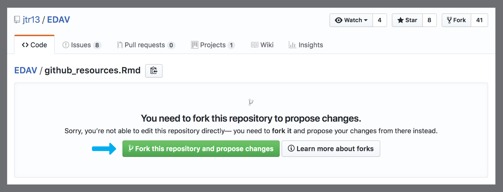
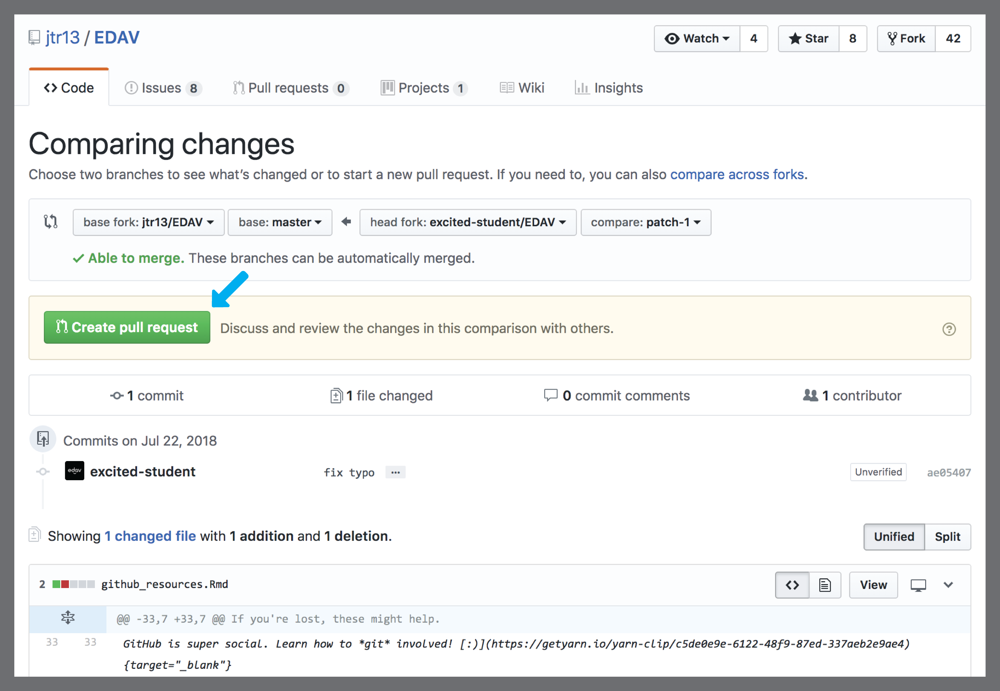
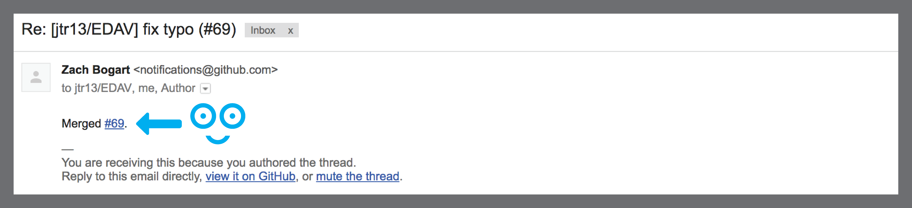
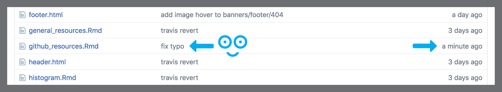
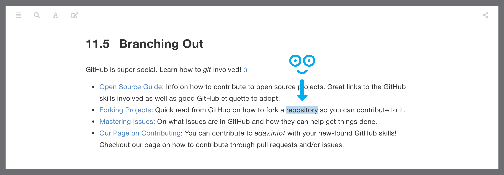

# Contribute to this Resource {#contribute}

## Why contribute?

We don't want *edav.info/* to be just another resource. Rather, we want it to be *your* resource. If there are things that trip you up or cause you frustration, chances are you're not alone. Everyone comes to this course with different backgrounds and expertise. Being able to collect all that knowledge in one place is this resource's mission and you can help move that mission forward.

## What to contribute

The focus of edav.info is the coding aspect of data visualization using R.  It is not meant to substitute for course lectures or provide much theory about exploratory data analysis and visualization.  We want to make it easy for students to find what they need quickly to produce a particular kind of graph. We are open to a wide range of contributions but we do have some ground rules:

* We are happy to receive *original work* that will help someone else. For example, if you worked out how to use a function that is not documented well, or mastered a type of graph that was difficult to get right, please share! On the other hand, if good tutorials already exist, there's no need to repeat the work.  Just submit a link to the resource with a short description to the appropriate chapter.

* And of course don't forget to cite your sources by providing links. 

## Ways to contribute

There are many ways you can contribute:

- <i class="fas fa-exclamation-circle"></i> For **large or small ideas, without providing the code** <i class="fas fa-arrow-right"></i> [**submit an issue**](#submit-an-issue) (very simple, much appreciated)

- <i class="fas fa-edit"></i> For **simple changes** <i class="fas fa-arrow-right"></i> [**contribute on GitHub**](#github-only-walkthrough) (this can all be done on **GitHub.com**... we've got a full walkthrough explaining how)

- <i class="fas fa-code-branch"></i> For **more complex changes** <i class="fas fa-arrow-right"></i> install Git and and work locally. Detailed instructions can be found in our [Git/GitHub Resources chapter](github.html) (the next level, also much appreciated) -- adventurous users may solve [**an open issue**](https://github.com/jtr13/EDAV/issues) (more advanced/open-ended)

## Submit an issue

If your proposed change is more complex, consider letting us know by **submitting an issue**. Maybe you have a great idea for a brand new chapter, something we have not covered but would like to see here in this resource (a new chart page, say; or a walkthrough using a specific tool/package). It may be a little too complicated to [contribute directly](#contribute-directly). What to do? Submit an issue, of course! 

[Issues](https://guides.github.com/features/issues/){target="_blank"} are tasks you can post to a GitHub repo that people can then take on and fix. They can be small ("this link is broken" / "add this resource") or complex ("I would love to have a chapter on..." / "reformat this code chunk in this way"). Once posted, issues can be taken on by anyone.

You do *not* have to know how to code up your issue; from fixing a bug to proposing a resource we should link to, we appreciate any feedback you have and will take it all into consideration.

**How to submit issues**:

1. Go to [our GitHub repo](https://github.com/jtr13/EDAV){target="_blank"} and click on the [Issues Tab](https://github.com/jtr13/EDAV/issues){target="_blank"}
2. Click on "[New Issue](https://github.com/jtr13/EDAV/issues/new){target="_blank"}"
3. Propose your Issue and click "Submit new issue"
4. That's it! We appreciate your input and will take your issue into account in improving *edav.info/* <i class="far fa-smile"></i>

**Notes about submitting issues**:

- Make sure your changes are not already an open issue (so as not to have redundant issues)
- Please thoroughly explain your proposed change when posting a new issue
- Consider [using labels](https://help.github.com/articles/applying-labels-to-issues-and-pull-requests/){target="_blank"} to specify the kind of issue, such as "bug", "enhancement", "help wanted", "question", or [create your own](https://help.github.com/articles/creating-a-label/){target="_blank"}.
- For more info, please consider reading the [Open Source Guide](https://opensource.guide/how-to-contribute/){target="_blank"} on how to contribute.

## GitHub only walkthrough

*You will need to create a github.com account if you don't have one, but you do not need to install git locally.*

**Note**: This is a full walkthough that follows a hypothetical student that spots a typo and uses a pull request to fix it. Although the instructions are written for proposing a change to *edav.info*, they apply to making changes to any repo. Navigate to the file you wish to edit, and click the pencil button:

**Do not click the fork button on the home page of the repo.** Then jump ahead to Step 4 below.

One way to contribute to *edav.info* is to contribute directly by editing a chapter. At the top of every page of this resource, you will see an icon that looks like this: <i class="fas fa-edit"></i>. Clicking it will open a new tab where you can edit the markdown for that page on [our GitHub repo](https://github.com/jtr13/EDAV){target="_blank"} and submit your change as a pull request. Essentially, you will create a copy of our repo, make your desired changes, and suggest to us that we include them. If we approve of your changes, they will be rendered and published to the site.

Contributing directly in this manner works best if the change you are proposing is something relatively small, such as a typo/grammatical error or an unclear phrasing/explanation. In general, it doesn't work well to propose changes to code directly on GitHub.

Ok, we're good to go. Get ready to hit lots of big green buttons! One last thing: remember there's no way to make changes to someone else's repo unless you submit a pull request *and* the owner merges it. So don't be afraid to act like the repo owner and click to edit files. You will be editing a copy of the files; it's ok!

### Step 1: Find something to change {-}

I'm pretty sure they meant to write "repository" here. Oops. Let's fix it for them!

*That's not how you spell "repository"! Let's fix it.*

### Step 2: Click the edit button {-}

To make the fix, we **click on the edit icon**, <i class="fas fa-edit"></i>, at the top of the page. This will take us to their GitHub repo, where all the code for this resource is stored.   **Note**: You need to have a valid GitHub account to contribute. In this example, we are using a dummy account called **excited-student** so if you see it in a screenshot, know that it would be replaced by your own username. 

*Hit this icon to go to GitHub.*

### Step 3: Fork the repo {-}

This is our first edit to the repo, so GitHub shows us a page like the one below. No worries! We just **hit the big green button** labeled **<i class="fas fa-code-branch"></i> Fork this repository and propose changes** and we'll be good to go (as you will see, big green buttons are our friends). **Note**: you will not have to fork the repo every time. If you propose another change in the future, the edit icon, <i class="fas fa-edit"></i>, will jump you directly to this point of the walkthrough.

*Haven't forked the repo before? No worries; the big green button will solve everything.*

Now that we have successfully forked the repo, we can **see the code** for the page we want to edit.  **Note**: That little blue blurb at the top is spelling out what is happening/going to happen: we have made a copy of a repo because we don't have write access to it . So, after we make our change on this page, we will inform the owners of the repo about our edits by using a pull request. GitHub can be super overwhelming, but it will try its darndest to inform you what will happen along the way.

*Ready to edit the code. The blue blurb is worth reading.*

### Step 4: Fix the typo {-}

Let's fix that embarrassing typo! We **update the code** right in this editor, **include an explanation** for what we changed/why we made the change, and then **hit the big green button** labeled **Propose file change**. Gotta love those big green buttons!

*Make your edits, include a quick explanation, and hit the big green button.*

### Step 5: Comparing changes {-}

Now GitHub is once again helping out by letting us review the changes we made. On this page we can **review our proposed changes** by scrolling down and looking at the [diffs](https://git-scm.com/docs/git-diff){target="_blank"}. Our fix is very simple so there isn't much to see. Once again, we are going to **push the big green button**, this time labeled **Create pull request**. This will start the process of letting the *edav.info/* people know that we would like them to include our changes (in git-speak, we are *requesting* that the *edav.info/* people do a `git merge` to update their files with our proposed changes.) Note that the proposed changes are in a branch called **patch-1** on our repo; we are asking to merge them into the **master** branch on their repo.

*Chance to review your changes. Once satisfied, hit the big green button to start a pull request.*

### Step 6: Open a pull request {-}

Here we are at the pull request page. Notice the green checkmark that says "*Able to merge*" (a good sign that everything is going smoothly). Now we **explain our pull request** with some comments and, once again, **hit the big green button** labeled **Create pull request**.  **Note**: You may be asking, "Why do I have to type this explanation in again?". This is because the explanation we wrote in Step 5 (where we edited the file) is a *commit*. We could have had *multiple* commits at once that we wanted to bundle into *one* pull request. This step is a way to explain the pull request as a whole. It is redundant for us because our change is so small and only has one commit. Still totally lost? This [GitHub Guide on Understanding the GitHub Flow](https://guides.github.com/introduction/flow/){target="_blank"} is an incredibly helpful read and [our GitHub Resources page](github.html) also has a lot of helpful links.

*Explain your pull request and hit the big green button.*

### What now? {-}

**Congratulations** are in order! We have **successfully opened a pull request on a GitHub repo!** Now one of the repo owners (like the guy writing this tutorial, for example <i class="far fa-smile-beam"></i>) has to decide if they want to include your pull request or not. In this case they'll certainly approve it, but know that they may decide against adding your changes. For more info, read the section of the Open Source Guides on [what happens after you submit a contribution](https://opensource.guide/how-to-contribute/#what-happens-after-you-submit-a-contribution){target="_blank"}.  **Note**: Be aware that the icon shown below may initially be yellow to signal that some tests are being performed to check the conflicts of your proposal with the original repo. It should turn green if everything passes.

*We did it! Now the maintainers will review our changes and get back to us...*

And now we wait...

<iframe src="https://giphy.com/embed/l2Jej6O5fbzxQ9PO0" width="480" height="366" frameBorder="0" class="giphy-embed" allowFullScreen></iframe>
<a href="https://giphy.com/gifs/thesimpsons-the-simpsons-3x23-l2Jej6O5fbzxQ9PO0">via GIPHY</a>

 

What's this!? We have received **an email from one of the repo owners**, Zach Bogart. And it says that they merged the change! Huzzah! We **click on the number** to take us back to the pull request we opened.

*We got an email! And it says they merged! Click that number to see the updated pull request.*

Here we are at the updated pull request page. Notice that **everything has turned purple**. Purple is the best color to see on GitHub; it's the color of victory. It signals that our pull request was merged with the repo, meaning our change has become part of the repo! Also, notice the button that says **Delete branch**. Since all the work on our branch was merged with the repo, it has served its purpose and can be deleted safely.

*Everything is purple! Woot!*

*Can safely delete our branch*

Now if we go back to the main page of the repo, we can **see our merge** was the most recent addition. And, if we scroll down, we will see that `github_resources.Rmd`, the file we edited, has been updated recently and it shows our commit message "fix typo". We did it! Let's check out the site to see our change published for the whole internet to see!

*Look! There's our merged pull request added to the repo!*

*And the edits we made to github_resources.Rmd!*

There it is! We go back to the page we edited and now **our typo fix has been included!** **Note**: The changes will take several minutes to appear on the site after notification of a successful merge. This is because we use [Travis CI](https://travis-ci.org/){target="_blank"} on the backend of our repo and it takes a little time for it to re-render the site pages. If you want to learn more about how you can use Travis CI to auto-magically generate your work, checkout [our section on Hooking Up Travis to a GitHub bookdown book](publish.html#hooking-up-travis) in the [Publishing Resources page](publish.html).

*Look at that! It's published! So many exclamation points!!!*

We contributed to a GitHub repo! Hooray! Time to celebrate!

<iframe src="https://giphy.com/embed/nxscd2YGVf6xi" width="480" height="369" frameBorder="0" class="giphy-embed" allowFullScreen></iframe> 
<a href="https://giphy.com/gifs/reaction-food-simpsons-nxscd2YGVf6xi" target="_blank">via GIPHY</a>

 

### Looking ahead: the next edit {-}

If you have a second edit to propose, simply follow the instructions again. As noted above, the second time through you will not be asked to fork the repo again. If you look closely at the pull request for the second edit, the branch to be merged will be named **patch-2** instead of **patch-1**. Although GitHub keeps mentioning "your fork" as you proceed through the process, this is not really something that you have to concern yourself with.  In fact, you're better off not!  In fact, you should stay away from your fork -- that is, your copy of the `EDAV` repo in *your* GitHub account, because it will inevitably get behind the main one and cause you trouble if you work on the old version and then try to create a pull request.  So, the bottom line is, each time you have an edit to propose, go directly to either `edav.info` or `https://github.com/jtr13/EDAV` and start the editing process there, *not on your fork!*.

## Resources

- [Our GitHub repo](https://github.com/jtr13/EDAV){target="_blank"}: Link to the GitHub repository for *edav.info/*
- [Open Source Guide](https://opensource.guide/how-to-contribute/){target="_blank"}: Fantastic guide on how to contribute to projects like this one
