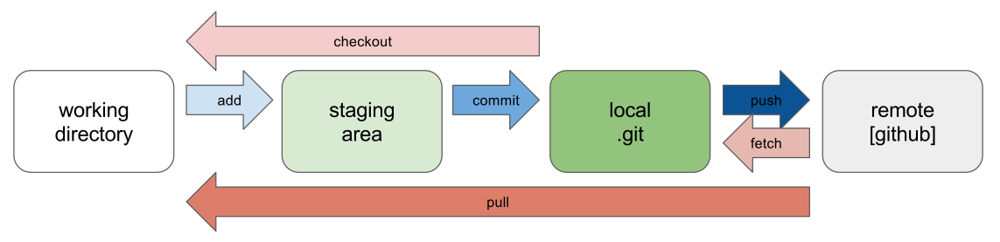

# Contribute to this Resource {#contribute}

## Overview

This page explains how to contribute to *edav.info/*.

## Why contribute?

We don't want *edav.info/* to be just another resource. Rather, we want it to be *your* resource. If there are things that trip you up or cause you frustration, chances are you're not alone. Everyone comes to this course with different backgrounds and expertise. Being able to collect all that knowledge in one place is this resource's mission and you can help move that mission forward.

## Ways you can contribute (Github only)

There are **three main ways** you can contribute:

- <i class="fas fa-edit"></i> For **simple changes** <i class="fas fa-arrow-right"></i> [**contribute directly**](#contribute-directly) (we got a full walkthrough on how to do this)
- <i class="fas fa-sticky-note"></i> For **bigger/more abstract suggestions** <i class="fas fa-arrow-right"></i> [**submit an issue**](#submit-an-issue) (very simple, much appreciated)
- <i class="fas fa-code-branch"></i> For **adventurous/social GitHub users** <i class="fas fa-arrow-right"></i> [**solve an open issue**](#solve-an-open-issue) (more advanced/open-ended, also much appreciated)

Below you'll find more detail on each option.

Happy coding! <i class="fas fa-heart"></i>

### Contribute directly

One way to contribute to *edav.info/* is to **contribute directly** by editing a chapter. At the top of every page of this resource, you will see an icon that looks like this: <i class="fas fa-edit"></i>. Clicking it will open a new tab where you can edit the markdown for that page on [our GitHub repo](https://github.com/jtr13/EDAV){target="_blank"} and submit your change as a pull request. Essentially, you will create a copy of our repo, make your desired changes, and suggest to us that we include them. If we approve of your changes, they will be rendered and published to the site.

Contributing directly works best if the change you are proposing is something relatively small, such as:

- A typo/grammatical error
- An unclear phrasing/explanation
- A quick code fix

#### Direct contribution walkthrough

This is a full walkthough on proposing a change to *edav.info/*. It follows a hypothetical student that spots a typo and uses a pull request to fix it. It's a little long, but don't get scared; it's a great way to learn about GitHub and it's almost entirely hitting big green buttons!

1. Let's **find something to change**. I'm pretty sure they meant to write "repository" here. Oops. Let's fix it for them!

*That's not how you spell "repository"! Let's fix it.*

2. To make the fix, we **click on the edit icon**, <i class="fas fa-edit"></i>, at the top of the page. This will take us to their GitHub repo, where all the code for this resource is stored.   **Note**: You need to have a valid GitHub account to contribute. In this example, we are using a dummy account called **excited-student** so if you see it in a screenshot, know that it would be replaced by your own username.

*Hit this icon to go to GitHub.*

3. We haven't forked the repo yet, so GitHub shows us a page like the one below. No worries! We just **hit the big green button** labeled **<i class="fas fa-code-branch"></i> Fork this repository and propose changes** and we'll be good to go (as you will see, big green buttons are our friends). For more info on forking repos, the [GitHub Guide on Forking Projects](https://guides.github.com/activities/forking/){target="_blank"} is very informative. **Note**: you will not have to fork the repo every time. If you propose another change in the future, the edit icon, <i class="fas fa-edit"></i>, will jump you directly to this point of the walkthrough. Just remember to [keep your fork up to date](https://help.github.com/articles/syncing-a-fork/){target="_blank"}.

*Haven't forked the repo before? No worries; the big green button will solve everything.*

4. Now that we have successfully forked the repo, we can **see the code** for the page we want to edit.  **Note**: That little blue blurb at the top is spelling out what is happening/going to happen: we have made a copy of a repo because we don't have write access to it . So, after we make our change on this page, we will inform the owners of the repo about our edits by using a pull request. GitHub can be super overwhelming, but it will try its darndest to inform you what will happen along the way.

*Ready to edit the code. The blue blurb is worth reading.*

5. Let's fix that embarrassing typo! We **update the code** right in this editor, **include an explanation** for what we changed/why we made the change, and then **hit the big green button** labeled **Propose file change**. Gotta love those big green buttons!

*Make your edits, include a quick explanation, and hit the big green button.*

6. Now GitHub is once again helping out by letting us review the changes we made. On this page we can **review our proposed changes** by scrolling down and looking at the [diffs](https://git-scm.com/docs/git-diff){target="_blank"}. Our fix is very simple so there isn't much to see. Once again, we are going to **push the big green button**, this time labeled **Create pull request**. This will start the process of letting the *edav.info/* people know that we would like them to include our changes (in git-speak, we are *requesting* that the *edav.info/* people do a `git merge` to update their files with our proposed changes.)

*Chance to review your changes. Once satisfied, hit the big green button to start a pull request.*

7. Here we are at the pull request page. Notice the green checkmark that says "*Able to merge*" (a good sign that everything is going smoothly). Now we **explain our pull request** with some comments and, once again, **hit the big green button** labeled **Create pull request**.  **Note**: You may be asking, "Why do I have to type this explanation in again?". This is because the explanation we wrote in Step 5 (where we edited the file) is a *commit*. We could have had *multiple* commits at once that we wanted to bundle into *one* pull request. This step is a way to explain the pull request as a whole. It is redundant for us because our change is so small and only has one commit. Still totally lost? This [GitHub Guide on Understanding the GitHub Flow](https://guides.github.com/introduction/flow/){target="_blank"} is an incredibly helpful read and [our GitHub Resources page](github.html) also has a lot of helpful links.

*Explain your pull request and hit the big green button.*

8. **Congratulations** are in order! We have **successfully opened a pull request on a GitHub repo!** Now one of the repo owners (like the guy writing this tutorial, for example <i class="far fa-smile-beam"></i>) has to decide if they want to include your pull request or not. In this case they'll certainly approve it, but know that they may decide against adding your changes. For more info, read the section of the Open Source Guides on [what happens after you submit a contribution](https://opensource.guide/how-to-contribute/#what-happens-after-you-submit-a-contribution){target="_blank"}.  **Note**: Be aware that the icon shown below may initially be yellow to signal that some tests are being performed to check the conflicts of your proposal with the original repo. It should turn green if everything passes.

*We did it! Now the maintainers will review our changes and get back to us...*

And now we wait...

<iframe src="https://giphy.com/embed/l0MYOUI5XfRk4LLWM" width="480" height="361" frameBorder="0" class="giphy-embed" allowFullScreen></iframe> <a href="https://giphy.com/gifs/warnerarchive-classic-film-warner-archive-l0MYOUI5XfRk4LLWM" target="_blank">via GIPHY</a>

 

9. What's this!? We have received **an email from one of the repo owners**, Zach Bogart. And it says that they merged the change! Huzzah! We **click on the number** to take us back to the pull request we opened.

*We got an email! And it says they merged! Click that number to see the updated pull request.*

10. Here we are at the updated pull request page. Notice that **everything has turned purple**. Purple is the best color to see on GitHub; it's the color of victory. It signals that our pull request was merged with the repo, meaning our change has become part of the repo! Also, notice the button that says **Delete branch**. Since all the work on our branch was merged with the repo, it has served its purpose and can be deleted safely.

*Everything is purple! Woot!*

*Can safely delete our branch*

11. Now if we go back to the main page of the repo, we can **see our merge** was the most recent addition. And, if we scroll down, we will see that `github_resources.Rmd`, the file we edited, has been updated recently and it shows our commit message "fix typo". We did it! Let's check out the site to see our change published for the whole internet to see!

*Look! There's our merged pull request added to the repo!*

*And the edits we made to github_resources.Rmd!*

12. There it is! We go back to the page we edited and now **our typo fix has been included!** **Note**: The changes will take several minutes to appear on the site after notification of a successful merge. This is because we use [Travis CI](https://travis-ci.org/){target="_blank"} on the backend of our repo and it takes a little time for it to re-render the site pages. If you want to learn more about how you can use Travis CI to auto-magically generate your work, checkout [our section on Hooking Up Travis to a GitHub bookdown book](publish.html#hooking-up-travis) in the [Publishing Resources page](publish.html).

*Look at that! It's published! So many exclamation points!!!*

We contributed to a GitHub repo! Hooray! Time to celebrate!

<iframe src="https://giphy.com/embed/nxscd2YGVf6xi" width="480" height="369" frameBorder="0" class="giphy-embed" allowFullScreen></iframe> 
<a href="https://giphy.com/gifs/reaction-food-simpsons-nxscd2YGVf6xi" target="_blank">via GIPHY</a>

 

13. Bear in mind that as time goes on, the code in your fork will fall behind that of the main project. If it's a project that you contribute to on a regular basis, you'll want to learn how to [keep your fork up to date.](https://help.github.com/articles/syncing-a-fork/). This unfortunately is a little more complex than it should be. An alternative is to delete your fork and start over. This may be the best option for infrequent contributions to the same project.

If what you want to improve is a little more substantial (too difficult to contribute directly), read on.

### Submit an issue

If your proposed change is more complex, consider letting us know by **submitting an issue**. Maybe you have a great idea for a brand new chapter, something we have not covered but would like to see here in this resource (a new chart page, say; or a walkthrough using a specific tool/package). It may be a little too complicated to [contribute directly](#contribute-directly). What to do? Submit an issue, of course! 

[Issues](https://guides.github.com/features/issues/){target="_blank"} are tasks you can post to a GitHub repo that people can then take on and fix. They can be small ("this link is broken" / "add this resource") or complex ("I would love to have a chapter on..." / "reformat this code chunk in this way"). Once posted, issues can be taken on by anyone.

You do *not* have to know how to code up your issue; from fixing a bug to proposing a resource we should link to, we appreciate any feedback you have and will take it all into consideration.

**How to submit issues**:

1. Go to [our GitHub repo](https://github.com/jtr13/EDAV){target="_blank"} and click on the [Issues Tab](https://github.com/jtr13/EDAV/issues){target="_blank"}
2. Click on "[New Issue](https://github.com/jtr13/EDAV/issues/new){target="_blank"}"
3. Propose your Issue and click "Submit new issue"
4. That's it! We appreciate your input and will take your issue into account in improving *edav.info/* <i class="far fa-smile"></i>

**Notes about submitting issues**:

- Make sure your changes are not already an open issue (so as not to have redundant issues)
- Please thoroughly explain your proposed change when posting a new issue
- Consider [using labels](https://help.github.com/articles/applying-labels-to-issues-and-pull-requests/){target="_blank"} to specify the kind of issue, such as "bug", "enhancement", "help wanted", "question", or [create your own](https://help.github.com/articles/creating-a-label/){target="_blank"}.
- For more info, please consider reading the [Open Source Guide](https://opensource.guide/how-to-contribute/){target="_blank"} on how to contribute.

### Solve an open issue

If you see an open issue that you think you can solve, by all means go for it! Simply fork our repo, add to the code base, and submit your work as a pull request. Checkout [our open issues](https://github.com/jtr13/EDAV/issues){target="_blank"} to see what needs doing. We appreciate any input you may have. **Note**: before getting too far into changing something, let us know in the github issue that you are working on solving it. This makes sure we are all on the same page.

Confused how to actually do what was mentioned above? We have [a thorough walkthrough example](#contribute-directly) that should help and make sure to checkout [our GitHub references page](github.html) for links to learn about GitHub.

For more info, please consider reading the [GitHub Guide on Forking Projects](https://guides.github.com/activities/forking/){target="_blank"} and the [Open Source Guide](https://opensource.guide/how-to-contribute/){target="_blank"} on how to contribute.

## Ways you can contribute (need to use Git)

For more involved changes including modifying R code, using Github only is not enough. In this case, one needs to first [install Git](https://happygitwithr.com/install-git.html){target="_blank"} and then [connect Git to your Github account](https://happygitwithr.com/hello-git.html){target="_blank"}. 

The next step is to [connect RStudio to Git and Github](https://happygitwithr.com/rstudio-git-github.html). Once connected, we can issue Git commands in the **Terminal** section of RStudio. There shall also be a **Git** tab in RStudio as well.

Now we have completed all the setup work and it's time to see the workflow of contributing to someone else's repo!

### Step 1: Fork the upstream repo (once)

Fork [our GitHub repo](https://github.com/jtr13/EDAV){target="_blank"} and then on your own Github page, you will see a forked **EDAV** repo under the repositories section. Note, from now on, the term **upstream repository** refers to the original repo of the project that you forked and the term **origin repository** refers to the repo that you created or forked on Github. From your respective, both **upstream** and **origin** are remote repositories.

### Step 2: Clone origin and create a local repository (once)

A **local repository** is the repo that resides on your computer. In order to be able to work locally, we need to create a local copy of the remote reposiotry.

Since we have already connected Git with RStudio, we can create a local repo in the following way. In RStudio, click **File** -> **New Project** -> **Version Control** -> **Git**. Now you can fill in the url of the **origin** repo and click **Create Project** to create a local repository.

Once created, make sure you can see a **Terminal** section in RStudio because this is where we type in all the Git command lines.

### Step 3: Configure remote that points to the upstream repository (once)

The purpose of this step is to specify the location of the upstream repository. It may not make sense to you at this moment, but soon it will become clear.

To complete this step, type in the following command line: 
**git remote add upstream <upstream repo url>**

### Step 4: Pull

Under the Git tab in RStudio, you can see a pull button, which is represented by a downward pointing arrow. Click that button is equivalent to running a git pull command. The purpose of a pull command is to fetch and download content from a remote repository, and in this case we want to pull from the **origin master** and make sure **local master** is updated to match the content. 

Now we can create a new branch and work on new features that we want to add into the **EDAV** project. Notice that steps 1, 2 and 3 only need to be done once when you start working on a new project. However, whenever you want to create a new branch, **pull command** is **always** the first step as you want to keep your local repository up to date. 

Now you might have a question: what is a branch? Branching is the way to work on different parts of a repository at one time. It creates a snapshot of the original branch. Eventually, after you have finalized your work, you will merge your work into the upstream repository. 

To create a branch, 

Click the purple button under the Git tab, create a meaningful name for your branch. For example, if you hope to add more content into the histogram chapter in EDAV, name your branch "HistogramChapter". In this way, both a local branch and a remote branch under the origin repo will be created.

### Step 5: Work, commit and push

Be careful and make sure you are doing work under the local branch instead of the local master. Once you make some changes in your local repository (e.g. edit, add or delete a file), you will see the list of files that you have modified under the Git tab. 

This means, the changes you have made are in your working directory but not committed to local repository yet. You might feel confused about these terms, so let's look at a graphical illustration.

We have already explained the relationship between local repo and remote repo. In addition, there are two extra layers between the working directory (the place where you store all these files on your computer) and the local repo. To keep your local repo updated with the working directory, you need to first **add** the changes to a **staging area** and then **commit** these changes to the local repo. Finally, you want to push your local branch to the remote repo.

When you use Git with RStudio, you do not need to write Git commands to add, commit or push. To **add**, you simply check the checkbox for each file you have modified. To **commit**, you just click on the **commit** button under the Git tab. In fact, you can commit as many times as needed. Finally, you can click on the **push** button, which is represented by an upward pointing arrow.

### Step 6: Submit a pull request

Now you are able to see the branch you have created on the Github page. The next step is to submit a pull request and the process is exactly the same as in [Direct contribution walkthrough].

### Last Step: Sync local master with upstream master

Once the merge is accepted, you want to delete this branch since the upstream already contains all the changes you have made. To delete the branch on origin, you can simply use Github. To delete the branch locally, you need to type **git branch -d branchname**. 

We also need to stop tracking the remote branch using the following Git command: **git fetch -p**. 

Finally, let's sync local master with upstream master by running these commands:

**git fetch upstream**

**git checkout master**

**git merge upstream/master**

For more detailed description on each step in the Git workflow, please refer to workflow 4 in the Git slides [Git/Github Workflow](https://github.com/jtr13/codehelp/blob/master/GitHubWorkflowPt2.pdf){target="_blank"}.

## Resources

- [Our GitHub repo](https://github.com/jtr13/EDAV){target="_blank"}: Link to the GitHub repository for *edav.info/*
- [Open Source Guide](https://opensource.guide/how-to-contribute/){target="_blank"}: Fantastic guide on how to contribute to projects like this one
- [Our Page of GitHub Resources](github.html): Confused about the GitHub basics? *Checkout* our page of resources (once you learn more about git, you'll realize that was a joke).

