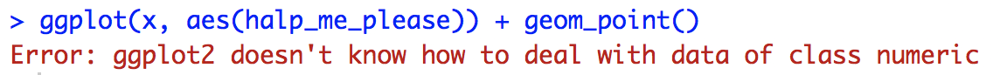

# Chart: Histogram {#histogram}

## tl:dr
Gimme a full-fledged example!

Here's an application of histograms that looks at how the beaks of Galapagos finches changed due to external factors:


And here's the code:

```r
library(Sleuth3) # data
library(ggplot2) # plotting

# load data
finches <- Sleuth3::case0201
# finch histograms by year with overlayed density curves
ggplot(finches, aes(x = Depth, y = ..density..)) + 
  # plotting
  geom_histogram(bins = 20, colour = "darkGrey", fill = "lightBlue", boundary = 0) +
  geom_density(color = "red") + 
  facet_wrap(~Year) +
  # formatting
  ggtitle("Severe Drought Led to Finches with Bigger Chompers",
          subtitle = "Beak Depth Density of Galapagos Finches by Year") +
  labs(x = "Beak Depth (mm)", caption = "Source: Sleuth3::case0201") +
  theme(plot.title = element_text(face = "bold")) +
  theme(plot.subtitle = element_text(face = "bold", color = "grey35")) +
  theme(plot.caption = element_text(color = "grey68"))
```

For more info on this dataset, type `?Sleuth3::case0201` into the console.

## Simple Examples
Whoa whoa whoa! Much simpler please!

Let's use a very simple dataset:

```r
# store data
x <- c(50, 51, 53, 55, 56, 60, 65, 65, 68)
```

### Histogram using Base R

```r
# plot data
hist(x, col = "lightblue", main = "Base R Histogram of x")
```


For the Base R histogram, it's advantages are in it's ease to setup. In truth, all you need to plot the data `x` in question is `hist(x)`, but we included a little color and a title to make it more presentable. 

Full documentation on `hist()` can be found [here](https://www.rdocumentation.org/packages/graphics/versions/3.5.0/topics/hist){target="_blank"}

### Histogram using ggplot2

```r
# import ggplot
library(ggplot2)
# must store data as dataframe
df <- data.frame(x)

# plot data
ggplot(df, aes(x)) +
  geom_histogram(color = "grey", fill = "lightBlue", 
                 binwidth = 5, center = 52.5)
```


The ggplot version is a little more complicated on the surface, but you get more power and control as a result. **Note**: as shown above, ggplot expects a dataframe, so if you are getting an error where "R doesn't know what to" like this:



make sure you are using a dataframe.

## When to use
Use a histogram to show the distribution of *one continuous variable*. The y-scale can be represented in a variety of ways to express different results:

*   **Count**: Number of points that fall in each bin
*   **Relative frequency**: (**Count**) / (Total Number of datapoints)
*   **Cumulative Frequency**: Accumulation of all previous **Relative frequencies**
*   **Density**: (**Relative Frequency**) / (binwidth)

## Considerations

*   Be mindful of the boundaries of the bins and whether a point will fall into the left or right bin if it is on a boundary.
*   The default binwidth of 30 is not always ideal, so consider altering it if things are looking strange.

## Theory

*   For more info about histograms and continuous variables, check out [Chapter 3](http://www.gradaanwr.net/content/03-examining-continuous-variables/){target="_blank"} of the textbook. 

## External Resources

- [DataCamp ggplot2 Histograms Exercise](https://campus.datacamp.com/courses/data-visualization-with-ggplot2-1/chapter-4-geometries?ex=5){target="_blank"}: Simple interactive example of histograms with ggplot2
- [DataCamp Histogram with Basic R](https://www.datacamp.com/community/tutorials/make-histogram-basic-r){target="_blank"}: "Tutorial for new R users whom need an accessible and easy-to-understand resource on how to create their own histogram with basic R.
" 'Nuff said.
- [DataCamp Histogram with ggplot2](https://www.datacamp.com/community/tutorials/make-histogram-ggplot2){target="_blank"}: Great article on making histograms with ggplot2.
- [hist documentation](https://www.rdocumentation.org/packages/graphics/versions/3.5.0/topics/hist){target="_blank"}: base R histogram documentation page.
- [ggplot2 cheatsheet](https://www.rstudio.com/wp-content/uploads/2015/03/ggplot2-cheatsheet.pdf){target="_blank"}: Always good to make close by.


<!-- Footer -->
<center>
</br></br>

</br></br>
</center>
