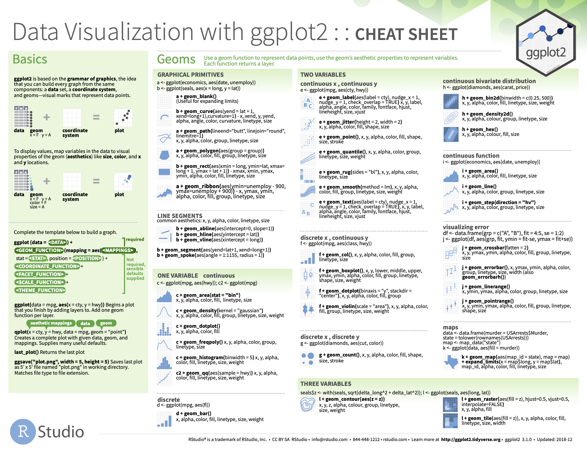
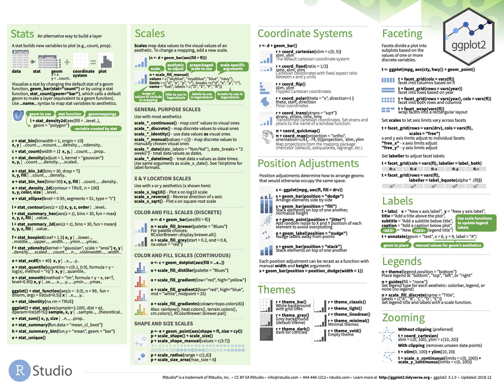

# Chinese traslation of ggplot2 overiew

Jingyue Lou
```{r global_options, include=FALSE}
knitr::opts_chunk$set(echo = TRUE, fig.pos = 'h')
```

## 本文来源

source:[https://ggplot2.tidyverse.org](https://ggplot2.tidyverse.org)

## 综述

ggplot2是一个说明型画图工具，其基础是《图形语法》一书。使用者提供数据以及画图指令和元素，ggplot2完成其余细节。

## 安装

```{r, eval=FALSE}
# 最简单的安装方法是安装整个tidyverse（##后部分）:
##install.packages("tidyverse")

#或者，可以安装ggolot2（##后部分）:
##install.packages("ggplot2")

# 或者从GitHub安装完善版本:
# install.packages("devtools")
devtools::install_github("tidyverse/ggplot2")
```

## 备忘录

```{r, echo=FALSE, out.width = "65%"}

```

```{r, echo=FALSE, out.width = "65%"}

```

## 用法

因其蕴含了深奥的可视化原理，ggplot2的工作原理很难完全充分的描述。然而，大部分情况下，使用者可以以$ggplot()$开始，提供数据和映射函数如$aes()$。然后添加层次如$geom\_point()$和$geom\_histogram()$，标准化函数如$scale\_colour\_brewer()$，多面化说明函数如$facet\_wrap()$，坐标系系统函数如$coord\_flip()$。

```{r, echo=FALSE}
library(ggplot2)

ggplot(mpg, aes(displ, hwy, colour = class)) + 
  geom_point()
```

## 产品周期

ggplot2被推出已超过10年并被数以万计的人使用绘制了数以百万的图表。大体来说，ggplot2本身并未有巨大的改动。当我们加以改动时，多是增加绘图函数或者元素而非改变已存在函数的功能，除非有绝对改动的原因。

在ggplot2的延伸系统中可以找到更多关于其的创新，相关的列表可见于[https://exts.ggplot2.tidyverse.org/gallery/](https://exts.ggplot2.tidyverse.org/gallery/)。

## 了解更多关于ggplot2

对于初学者，更好的方法了解ggplot2是学习一份系统的介绍，而不是阅读单独的函数介绍文件。现有三份可供参考的学习材料：

1.[《R数据科学》](https://r4ds.had.co.nz)一书的《使用ggplot2进行可视化》和《使用Markdown格式化文本》两个章节。《R数据科学》一书提供了对$tidyverse$的全面介绍。这两个章节可用于ggplot2基本元素的快速入门。

2.网上教程可参考Kara Woo的[Data Visualization in R With ggplot2](https://www.oreilly.com/library/view/data-visualization-in/9781491963661/)。

3.如果使用者想尽快绘制常见的图表，可参考Winston Chang的[《R数据可视化手册》](https://amzn.to/2TU78ip)。此书提供了解决常见图表问题的公式。

如果使用者已掌握了基础的ggplot2并想了解更多内容，可以参考阅读[ 《ggplot2:数据分析与图形艺术》](https://www.amazon.com/ggplot2-Elegant-Graphics-Data-Analysis/dp/331924275X/ref=as_li_ss_tl?ie=UTF8&linkCode=sl1&tag=ggplot2-20&linkId=4b4de5146fdafd09b8035e8aa656f300)，此书讲述了ggplot2理论上的基础成分以及它们是如何拼合在一起的。此书有助于理解ggplot2的基本原理，并且可帮助使用者根据需求量身定制图表。

## 帮助

两个主要提供ggplot2技术帮助的平台是：

1.[RStudio 社区](https://community.rstudio.com)是一个解决各种ggplot2问题的用户友好平台。

2.[IT问答平台 Stack Overflow](https://stackoverflow.com/questions/tagged/ggplot2?sort=frequent&pageSize=50)是一个提供常见ggplot2问题答案的优质资源。如果可以提供可复制的代码示例来描述问题，使用者可以得到更好地帮助。


