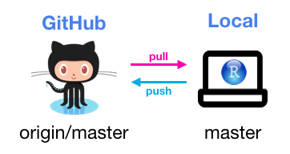
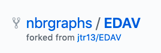
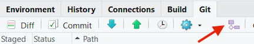
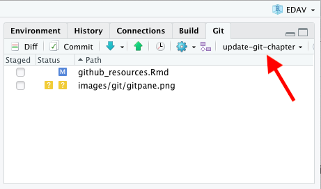
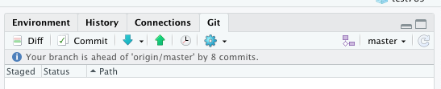

# GitHub/git Resources {#github}

## Overview

This section describes workflows for working with GitHub/git and advice on how to collaborate in teams on large coding projects. If you're interested in learning how to propose changes to [edav.info](edav.info) (or any other repo) without leaving github.com, see our [Contributing to this Resource](contribute.html) chapter.

Ok, not satisfied with fixing typos on GitHub? Ready to work locally and move code back and forth between your repositories (or someone else's) and your machine? For that you'll need Git, a widely used version control system. It is super useful and powerful, but people also find it quite annoying and [difficult to understand](https://xkcd.com/1597/){target="_blank"}. Rather than trying to master the whole system, we suggest beginning with some basic workflows, as outlined below.  You can derive great benefits from it without being an expert (trust me, I know!)
 
## First things first

1. *Install Git* To do so, follow the instructions in the [Install Git](https://happygitwithr.com/install-git.html){target="_blank"} chapter of *Happy Git with R*.

2. *Tell git your name and email address.* [Introduce yourself to Git](https://happygitwithr.com/hello-git.html){target="_blank"} in *Happy Git* explains it all.

3. (Optional) *Make sure that you can pull from and push to GitHub from your computer* [Connect to GitHub](https://happygitwithr.com/push-pull-github.html){target="_blank"} 

## The no branch workflow

To get comfortable with Git, start with this basic workflow in which you will be pulling from and pushing to *your* repo on GitHub. Just you, no collaboration:

The [Connect RStudio to Git and GitHub](https://happygitwithr.com/rstudio-git-github.html){target="_blank"} chapter of *Happy Git* will get you set up: you will create a repo on GitHub, clone the repo into an RStudio project, and practice making changes.

Once you're set up, your local workflow will be **pull, work, commit/push**. 

**PULL** Each time you open RStudio and switch to the project, you will pull down any changes made to the repo on GitHub by clicking the **Down Arrow** in the Git pane of RStudio. You may think that no changes have been made to GitHub and there's nothing to pull, but you may forget the typos that you fixed online, so it's good practice to always start by pulling changes just in case.

**WORK** Do your stuff. Make changes to files. Add new files.  Keep an eye on the Git panel in RStudio; it will show you which files were changes.

**COMMIT/PUSH** When you're done working, you'll want to think about what to do with the files that have changed. I like to keep the Git panel clear, so when I'm done I do one of three things with each file: 1) click "Staged" to get it ready for a sendoff to GitHub, 2) delete it if it's not needed, 3) add it to `.gitignore` if it's a file I want to keep locally but not send to GitHub. (Keep in mind that files in .gitignore are not backed up unless you have another backup system.) If I have a file that belongs somewhere else, I will move it there, so the only files left are the ones to send to GitHub.

The next step is to click the **Commit** button and enter a commit message that meaningful describes what was done. Finally clicking the **Up Arrow** will send the commit to GitHub. 

It's not considered good practice to commit too often, but as a beginner, it's useful to do so to learn how it all works.

## Your repo with branching

Once you've comfortable with the workflow described above, you're ready to start branching. The process is quite similar whether you're working on your own repo or someone else's. 

If it's *your* repo, you can follow the steps in [these slides](https://github.com/jtr13/EDAV/blob/master/pdfs/BranchingYourRepo.pdf){target="_blank"}, which provide step-by-step detail on creating a branch, doing work on the branch and then submitting a pull request to merge the changes into origin/master. Or you can follow the steps below, skipping steps 1 and 3.

## 1st PR on another repo with branching

### Step 1: Fork the upstream repo (once) {-}

*Skip this step if you are syncing with your own repo--that is, you created the repo, you're not cloning a fork of someone else's repo.*

Let's say you want to contribute to EDAV! Fork [our GitHub repo](https://github.com/jtr13/EDAV){target="_blank"} and then on your own GitHub page, you will see a forked **EDAV** repo under the repositories section. Note, from now on, the term **upstream repository** refers to the original repo of the project that you forked and the term **origin repository** refers to the repo that you created or forked on GitHub. From your respective, both **upstream** and **origin** are remote repositories.

*A fork of jtr13/EDAV*

### Step 2: Clone origin and create a local repository (once) {-}

A **local repository** is the repo that resides on your computer. In order to be able to work locally, we need to create a local copy of the remote reposiotry.

Since we have already connected git with RStudio, we can create a local repo in the following way. In RStudio, click **File** -> **New Project** -> **Version Control** -> **Git**. Now you can fill in the url of the **origin** repo and click **Create Project** to create a local repository.

### Step 3: Configure remote that points to the upstream repository (once) {-}

*Skip this step if you're syncing with your own repo.*

The purpose of this step is to specify the location of the upstream repository, that is, the original project, not your copy of it.

To complete this step, type in the following command line: 

`> git remote add upstream <upstream repo url>`

Source: [Configuring a remote for a fork](https://help.github.com/en/articles/configuring-a-remote-for-a-fork){target="_blank"}

### Step 4: Branch {-}

With this workflow, all new work is done on a branch, so it's important to remember to create a new branch before you begin working. Once the work is complete, a pull request is submitted and if all goes well the new code will be merged into the master branch of the project on GitHub.

When you're ready to start working on something new, create a new branch. **Do not reuse a merged branch.** Each "fix" should get its own branch and be deleted after it's been merged.

To create a branch, click on the button shown below:

 

   
  
Give your new branch a meaningful name. For example, if you intend to add a faceting example to the histogram chapter, you might call your branch `add_hist_facet`. Leave the "Sync branch with remote" box checked. Thereby you will not only create a local branch but also a remote branch on origin, and the local branch will be set up to track the remote branch. In short, they will be linked and git will take note of any changes on the other.

### Step 5: Work, commit and push {-}

When you create a branch following the method in Step 4, you will be automatically switched to the new branch. You can switch branches by clicking on the branch dropdown box to the right of the new branch button. However, be careful doing so. Work that isn't committed, even if it is saved, doesn't belong to a branch so it will move with you as you change branches. This makes it easy to accidentally be on the wrong branch. Check that you are in the right place and as you work keep an eye on changed files in the Git pane.

  
 

Recall that there are three steps to moving saved work from your working directory to GitHub, represented by the git commands: `add`, `commit`, and `push`.

 

 

In RStudio, to **add**, you simply click the checkbox for each file you have modified in the "staged" column on the left of the Git pane. To **commit**, you just click on the **commit** button under the Git tab. Entering a commit message is mandatory; choose a meaningful description of the code changes. Finally, to push changes to GitHub, click on the **push** button, which is represented by an upward pointing arrow. You can combine multiple commits into one "push".

It is not considered good practice to commit too enough because all the commits are entered into the commit history and it's hard to find what you need if you commit your work every five minutes. (As you're starting out, though, I wouldn't be concerned about this. It's more important to use the commands frequently to gain experience.)

The [Repeated Amend chapter of Happy Git with R](https://happygitwithr.com/repeated-amend.html){target="_blank"} describes one approach to dealing with the how-often-should-I-commit dilemma.

### Step 6: Submit a pull request {-}

Now you are able to see the branch you have created on the GitHub page. The next step is to submit a pull request and the process is very similar to the process described in the [GitHub only walkthrough](contribute.html#step-5-comparing-changes), beginning with step 6.

### Step 7: Merge the pull request {-}

If you submitted a PR to another project, you are not the one who will be merging the pull request, so there's nothing for you to do here. 

If it is your project, and it is your job to do so, be aware that there are many methods to merge a request. The most direct simple and direct is to [merge the PR on GitHub](https://help.github.com/en/articles/merging-a-pull-request#merging-a-pull-request-on-github). This method works well for merging fixed typos and the like. If you want to be able to test code, you may want to check out the PR locally, test it, and perhaps even make edits to it before merging. 

Best practices in this area are evolving. My current recommendation is to use the `usethis` package, which makes complex tasks very simple. ["How to edit a pull request locally"](https://github.com/jtr13/usethis_demos/blob/master/how_to1.md) explains how to do so.

Another great resource is ["Explore and extend a pull request"](https://happygitwithr.com/pr-extend.html) in *Happy Git with R*. This chapter describes two official GitHub versions of merging a pull request, as well as a workflow in development using `git2r`. 

## 2nd-*n*th PR on another repo with branching

After the first pull request, the process changes a little. We no longer need to fork and clone the repo. What we do need to do though is make sure that our local copy of the repository is up to date with the GitHub version.  There is some other cleanup we need to do, so after the first pull request, we'll replace steps #1 - #3 above with the following:

### Step 1: Sync {-}

How you sync depends on whether you are syncing with your own repo ("origin") or someone else's repo ("upstream"). This should be done at the beginning of every work session.

**Your repo**

Switch to the master branch (important!), then click the pull button (down arrow) in the Git pane in RStudio. Or you can type the following in the Terminal:

`> git checkout master`  

`> git pull`

There are no reminders that you're behind, so it's up to you. Make it a habit.

**Someone else's repo**

If you're working on someone else's repo, make sure you've [configured an upstream remote](https://edav.info/github.html#step-3-configure-remote-that-points-to-the-upstream-repository-once).

Then do the following to update your fork:

`> git fetch upstream`

`> git checkout master`

`> git merge upstream/master`

Source: [Syncing a fork](https://help.github.com/en/articles/syncing-a-fork){target="_blank"}

Note that these commands bring in changes directly from the upstream repo. 

### Step 2: Delete the old branch {-}

If your previous pull request was merged, it's good practice to delete the associated branch since the upstream already contains all the changes you have made. To fully delete a branch you will need to 1) delete the local branch, 2) delete the remote branch, 3) stop tracking the branch:

1. One way to delete the remote branch is to do so on GitHub. Navigate to the closed pull request on the upstream repo. If your branch has been merged, the pull request dialogue will display the following message: "You’re all set—the `<branchname>` branch can be safely deleted." Simply click on the Delete branch button next to the message. 

If you prefer to work in the terminal, you can delete the remote branch with:

`> git push origin --delete <branchname>`

2. To delete the local branch, switch to the master branch in RStudio and then type the following in the terminal:

`> git branch -d branchname`

3. Take note that git doesn't stop tracking the remote branch even though it's gone in both places! To stop tracking deleted branches use the following:

`> git fetch -p`

Otherwise you will still see the deleted branches listed in RStudio's Git pane, and they will still appear when you look at all of your branches with 

`> git branch -a`  (* = checked out branch)

Speaking of which, be aware that the Git pane doesn't tend to update in real time, so you'll likely still see branches listed that have been deleted. Be careful not to switch to them, or you will inadvertently recreate them. (Deleted branches have a habit of coming back.) Clicking on master (even though you're already on master) appears to trigger an update of the dropdown list. If that doesn't work, switching out of the project and back in will do so, if you want to be sure that the branches you deleted are really gone.

#### Troubleshooting {-}

- Make sure you're not on the branch you're trying to delete.

- Note that if you try to delete a branch that hasn't been fully merged, you'll get a warning, or perhaps an error depending on what's transpired. It's possible that it just *thinks* it hasn't been merged even though it has, since you're not up to date. This can be remedied with `git pull`. In other cases, you'll need to follow the instructions to use `-D` instead of `-d`, for example, if you decide to abandon and delete a branch without submitting a pull request.

- If you have trouble getting rid of branches, rest assured, that you're not alone. [How do I delete a Git branch locally and remotely?](https://stackoverflow.com/questions/2003505/how-do-i-delete-a-git-branch-locally-and-remotely){target="_blank"} is the **[third most asked question](https://stackoverflow.com/questions?sort=votes){target="_blank"}** on StackOverflow!

### Step 3: Update your fork on GitHub {-}

Skip this step if there's no upstream repo.

Yes, it's odd, but once you've forked and cloned the project repo, the copy on GitHub becomes fairly irrelevant. However it's not a bad idea to keep it up to date, if for no other reason than it's disturbing to see messages like the following in your Git pane:

 

 

Thankfully, your fork on GitHub can be updated easily by clicking the green up arrow or entering `git push` in the Terminal.

### Steps 4-7: See above {-}

Now we're ready to repeat the branch, work, commit, push, submit a pull request workflow. To do so, follow [Steps 4-7 above](#step-4-branch).

## Random git stuff that may be useful

### Undo the last commit

`git reset --soft HEAD~1`

### Undo changes since the last commit

`git reset HEAD --hard`

### Forgot to branch (didn't commit)

Just create the new branch and changes will be moved there... [changes in the working directory do not belong to a branch until they are committed](https://stackoverflow.com/a/1394804/5314416){target="_blank"} (It will appear that the changes are on master too, but once you commit the changes, they will be gone from master.)

### Undo deleted branch

Look for the SHA (hash) returned when you deleted the branch. Then do:

`git checkout -b <branch-name> <SHA>`   

See also: [Git undo local branch delete](https://stackoverflow.com/a/39038276/5314416){target="_blank"}

## Other resources

### Getting Help {-}

If you're lost, these might help.

- [GitHub Guides](https://guides.github.com/){target="_blank"}: This is a phenomenal collection of short articles from GitHub to help you learn about the fundamentals around their product. They are so great, we have already listed their Hello World article. Here are some other important ones:
    - [Understanding the GitHub Flow](https://guides.github.com/introduction/flow/){target="_blank"}: Explains how working with GitHub generally goes.
    - [Git Handbook](https://guides.github.com/introduction/git-handbook/){target="_blank"}: Explains what version control is.
- [GitHub Help](https://help.github.com/){target="_blank"}: This is the yellow-pages of GitHub. Ask a question and it will try to *push* you in the right direction. [Get it?](https://getyarn.io/yarn-clip/6e7f4795-b65b-4fad-b1fb-c5c9161a95fa){target="_blank"}

### Branching out {-}

GitHub is super social. Learn how to *git* involved! [<i class="far fa-smile"></i>](https://getyarn.io/yarn-clip/c5de0e9e-6122-48f9-87ed-337aeb2e9ae4){target="_blank"}

- [Open Source Guide](https://opensource.guide/how-to-contribute/){target="_blank"}: Info on how to contribute to open source projects. Great links to the GitHub skills involved as well as good GitHub etiquette to adopt.
- [Forking Projects](https://guides.github.com/activities/forking/){target="_blank"}: Quick read from GitHub on how to fork a repository so you can contribute to it.
- [Mastering Issues](https://guides.github.com/features/issues/){target="_blank"}: On what Issues are in GitHub and how they can help get things done.
- [Our Page on Contributing](contribute.html): You can contribute to *edav.info/* with your new-found GitHub skills! Checkout our page on how to contribute through pull requests and/or issues.

### More Resources {-}

To hit the ground running, checkout [GitHub Learning Lab](https://lab.github.com/){target="_blank"}. This application will teach you how to use GitHub with hands-on courses using actual repos. Its the perfect way to understand what using GitHub looks like.

For the [nerds in the room](https://getyarn.io/yarn-clip/64bbb001-ed8a-450a-8826-b939f653b969){target="_blank"}...

- [Git For Ages 4 And Up](https://www.youtube.com/watch?v=3m7BgIvC-uQ){target="_blank"}: There's a lot going on under the hood. This talk will help explain how it all works...with kids toys!

- [Make pretty git logs](https://stackoverflow.com/questions/1057564/pretty-git-branch-graphs){target="_blank"}: Always remember [(A DOG)](https://i.stack.imgur.com/ElVkf.jpg){target="_blank"}. Also, this alias command is nice to have around:
    - `git config --global alias.adog "log --all --decorate --oneline --graph"`
- [`add` and `commit` with one command](https://stackoverflow.com/questions/4298960/git-add-and-commit-in-one-command){target="_blank"}: Another (even more) helpful alias command:
    - `git config --global alias.add-commit '!git add -A && git commit'`
- [Git Aware Prompt](https://github.com/jimeh/git-aware-prompt){target="_blank"}: An excellent add-on to the Terminal that informs you which branch you have checked out. Someone also made [an even spiffier version](https://github.com/udondan/git-aware-prompt){target="_blank"} where it will inform you of your git status using helpful emojis.
- [Contributing with git2r](https://popgen.nescent.org/CONTRIBUTING_WITH_GIT2R.html){target="_blank"}, on the [Population Genetics in R](https://popgen.nescent.org/index.html){target="_blank"} provides helpful information on using git commands within R through the git2r package. In particular it explains how to create a GITHUB_PAT and then set the `credential` parameter in certain functions to find the PAT. (Note though that the site was created in 2015 and as of February 2019 has not been updated.)
- **Want a little reading as well?**: [Resources to learn Git](https://try.github.io/){target="_blank"} is a simple site split into two main sections: *Learn by reading* and *Learn by doing*. Take your pick. <i class= "far fa-smile"></i>
- [A Newbie's Guide to Making A Pull Request (for an R package)](https://tonyelhabr.rbind.io/post/making-first-pull-request/){target="_blank"}, Tony Elhabr's experience submitting a pull request to an R package at tidyverse developer day (part of [rstudio::conf 2019](https://www.rstudio.com/conference/){target="_blank"}.
