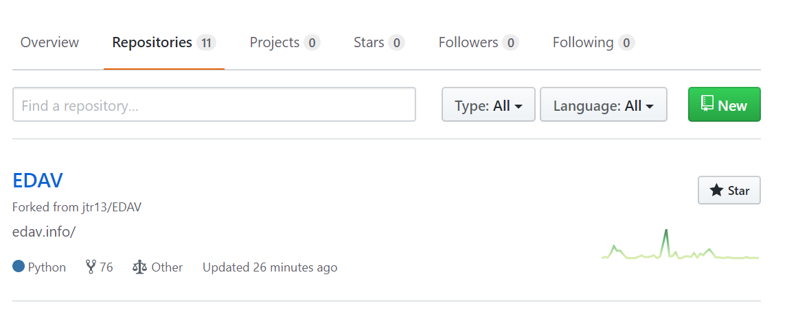
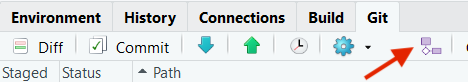
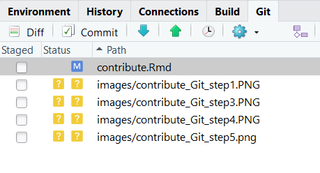

# GitHub/Git Resources {#github}

## Overview

This section includes links for working with GitHub/Git and advice on how to collaborate in teams on large coding projects.

## Introduction

I don't wanna just *read* about GitHub/Git; I wanna learn by *doing*!

We love your enthusiasm. To hit the ground running, checkout [GitHub Learning Lab](https://lab.github.com/){target="_blank"}. This application will teach you how to use GitHub with hands-on courses using actual repos. Its the perfect way to understand what using GitHub looks like.

In this course, you will be working on a [project](project.html) in teams. Because of this, you probably want to be able to share code and work on different parts of the project simultaneously. This is where Git and GitHub comes in. 

[GitHub](https://github.com/){target="_blank"} is a way to work on projects and keep track of their status easily and efficiently. It is built off of [Git](https://git-scm.com/){target="_blank"}, a type of [version control](https://en.wikipedia.org/wiki/Version_control){target="_blank"} software. It is super useful and powerful, but people also find it quite annoying and [difficult to understand](https://xkcd.com/1597/){target="_blank"}. So, in an effort to help you, we have collected some resources to learn about GitHub and how you can use it to work on projects.

## On GitHub

What's GitHub? Start here.

- [Hello World](https://guides.github.com/activities/hello-world/){target="_blank"}: GitHub's take on the "Hello World" program. Great starting point to learn how GitHub works.
- [Github Training & Guides](https://www.youtube.com/githubguides){target="_blank"}: This YouTube Channel has a lot of info about what GitHub can do. The first line of the opening video is, "Okay. You signed up for GitHub.  What do you do now?". If you are asking that very question, this channel will serve you well.

## On Git

What's Git? Git is a widely used version control system, which is especially useful in collaborative projects. Why use Git? For small changes such as typos, we can directly fix it on Github. However, when you want to modify code and more complicated stuff, using Git becomes necessary.

Before we go deeper into the matter, take a look at the [Git Hankbook](https://guides.github.com/introduction/git-handbook/){target="_blank"} to get started.

You also need to do some setup work. First [install Git](https://happygitwithr.com/install-git.html){target="_blank"} and then [connect Git to your Github account](https://happygitwithr.com/hello-git.html){target="_blank"}. There is an option to [connect RStudio to Git and Github](https://happygitwithr.com/rstudio-git-github.html). Once connected, we can issue Git commands in the **Terminal** section of RStudio. There shall also be a **Git** tab in RStudio as well. 

Now let's walk you through a detailed workflow on contributing other's work. In this example, we will use Git with RStudio for illustration purpose.

### Step 1: Fork the upstream repo (once) {-}

Let's say you want to contribute to EDAV! Fork [our GitHub repo](https://github.com/jtr13/EDAV){target="_blank"} and then on your own Github page, you will see a forked **EDAV** repo under the repositories section. Note, from now on, the term **upstream repository** refers to the original repo of the project that you forked and the term **origin repository** refers to the repo that you created or forked on Github. From your respective, both **upstream** and **origin** are remote repositories.

### Step 2: Clone origin and create a local repository (once) {-}

A **local repository** is the repo that resides on your computer. In order to be able to work locally, we need to create a local copy of the remote reposiotry.

Since we have already connected Git with RStudio, we can create a local repo in the following way. In RStudio, click **File** -> **New Project** -> **Version Control** -> **Git**. Now you can fill in the url of the **origin** repo and click **Create Project** to create a local repository.

Once created, make sure you can see a **Terminal** section in RStudio because this is where we type in all the Git command lines.

### Step 3: Configure remote that points to the upstream repository (once) {-}

The purpose of this step is to specify the location of the upstream repository. It may not make sense to you at this moment, but soon it will become clear.

To complete this step, type in the following command line: 
**git remote add upstream <upstream repo url>**

### Step 4: Pull {-}

Under the Git tab in RStudio, you can see a pull button, which is represented by a downward pointing arrow. Clicking that button is equivalent to running a git pull command. The purpose of a pull command is to fetch and download content from a remote repository, and in this case we want to pull from the **origin master** and make sure **local master** is updated to match the content. 

Now we can create a new branch and work on new features that we want to add into the **EDAV** project. Notice that steps 1, 2 and 3 only need to be done once when you start working on a new project. However, whenever you want to create a new branch, **pull command** is **always** the first step as you want to keep your local repository up to date. 

Now you might have a question: what is a branch? Branching is the way to work on different parts of a repository at one time. It creates a snapshot of the original branch. Eventually, after you have finalized your work, you will merge your work into the upstream repository. 

To create a branch, 

Click the purple button under the Git tab, create a meaningful name for your branch. For example, if you hope to add more content into the histogram chapter in EDAV, name your branch "HistogramChapter". In this way, both a local branch and a remote branch under the origin repo will be created.

### Step 5: Work, commit and push {-}

Be careful and make sure you are doing work under the local branch instead of the local master. Once you make some changes in your local repository (e.g. edit, add or delete a file), you will see the list of files that you have modified under the Git tab. 

This means, the changes you have made are in your working directory but not committed to local repository yet. You might feel confused about these terms, so let's look at a graphical illustration.

We have already explained the relationship between local repo and remote repo. In addition, there are two extra layers between the working directory (the place where you store all these files on your computer) and the local repo. To keep your local repo updated with the working directory, you need to first **add** the changes to a **staging area** and then **commit** these changes to the local repo. Finally, you want to push your local branch to the remote repo.

When you use Git with RStudio, you do not need to write Git commands to add, commit or push. To **add**, you simply check the checkbox for each file you have modified. To **commit**, you just click on the **commit** button under the Git tab. In fact, you can commit as many times as needed. Finally, you can click on the **push** button, which is represented by an upward pointing arrow.

### Step 6: Submit a pull request {-}

Now you are able to see the branch you have created on the Github page. The next step is to submit a pull request and the process is exactly the same as in [Direct contribution walkthrough].

### Last Step: Sync local master with upstream master {-}

Once the merge is accepted, you want to delete this branch since the upstream already contains all the changes you have made. To delete the branch on origin, you can simply use Github. To delete the branch locally, you need to type **git branch -d branchname**. 

We also need to stop tracking the remote branch using the following Git command: **git fetch -p**. 

Finally, let's sync local master with upstream master by running these commands:

**git fetch upstream**

**git checkout master**

**git merge upstream/master**

For more detailed description on each step in the Git workflow, please refer to workflow 4 in the Git slides [Git/Github Workflow](https://github.com/jtr13/codehelp/blob/master/GitHubWorkflowPt2.pdf){target="_blank"}.

## Other resources

### Getting Help {-}

If you're lost, these might help.

- [GitHub Guides](https://guides.github.com/){target="_blank"}: This is a phenomenal collection of short articles from GitHub to help you learn about the fundamentals around their product. They are so great, we have already listed their Hello World article. Here are some other important ones:
    - [Understanding the GitHub Flow](https://guides.github.com/introduction/flow/){target="_blank"}: Explains how working with GitHub generally goes.
    - [Git Handbook](https://guides.github.com/introduction/git-handbook/){target="_blank"}: Explains what version control is.
- [GitHub Help](https://help.github.com/){target="_blank"}: This is the yellow-pages of GitHub. Ask a question and it will try to *push* you in the right direction. [Get it?](https://getyarn.io/yarn-clip/6e7f4795-b65b-4fad-b1fb-c5c9161a95fa){target="_blank"}

### Branching out {-}

GitHub is super social. Learn how to *git* involved! [<i class="far fa-smile"></i>](https://getyarn.io/yarn-clip/c5de0e9e-6122-48f9-87ed-337aeb2e9ae4){target="_blank"}

- [Open Source Guide](https://opensource.guide/how-to-contribute/){target="_blank"}: Info on how to contribute to open source projects. Great links to the GitHub skills involved as well as good GitHub etiquette to adopt.
- [Forking Projects](https://guides.github.com/activities/forking/){target="_blank"}: Quick read from GitHub on how to fork a repository so you can contribute to it.
- [Mastering Issues](https://guides.github.com/features/issues/){target="_blank"}: On what Issues are in GitHub and how they can help get things done.
- [Our Page on Contributing](contribute.html): You can contribute to *edav.info/* with your new-found GitHub skills! Checkout our page on how to contribute through pull requests and/or issues.

### More Resources {-}

For the [nerds in the room](https://getyarn.io/yarn-clip/64bbb001-ed8a-450a-8826-b939f653b969){target="_blank"}...

- [Git For Ages 4 And Up](https://www.youtube.com/watch?v=3m7BgIvC-uQ){target="_blank"}: There's a lot going on under the hood. This talk will help explain how it all works...with kids toys!
- [Make pretty git logs](https://stackoverflow.com/questions/1057564/pretty-git-branch-graphs){target="_blank"}: Always remember [(A DOG)](https://i.stack.imgur.com/ElVkf.jpg){target="_blank"}. Also, this alias command is nice to have around:
    - `git config --global alias.adog "log --all --decorate --oneline --graph"`
- [`add` and `commit` with one command](https://stackoverflow.com/questions/4298960/git-add-and-commit-in-one-command){target="_blank"}: Another (even more) helpful alias command:
    - `git config --global alias.add-commit '!git add -A && git commit'`
- [Git Aware Prompt](https://github.com/jimeh/git-aware-prompt){target="_blank"}: An excellent add-on to the Terminal that informs you which branch you have checked out. Someone also made [an even spiffier version](https://github.com/udondan/git-aware-prompt){target="_blank"} where it will inform you of your git status using helpful emojis.
- [Contributing with git2r](https://popgen.nescent.org/CONTRIBUTING_WITH_GIT2R.html){target="_blank"}, on the [Population Genetics in R](https://popgen.nescent.org/index.html){target="_blank"} provides helpful information on using git commands within R through the git2r package. In particular it explains how to create a GITHUB_PAT and then set the `credential` parameter in certain functions to find the PAT. (Note though that the site was created in 2015 and as of February 2019 has not been updated.)
- **Want a little reading as well?**: [Resources to learn Git](https://try.github.io/){target="_blank"} is a simple site split into two main sections: *Learn by reading* and *Learn by doing*. Take your pick. <i class= "far fa-smile"></i>
- [A Newbie's Guide to Making A Pull Request (for an R package)](https://tonyelhabr.rbind.io/post/making-first-pull-request/){target="_blank"}, Tony Elhabr's experience submitting a pull request to an R package at tidyverse developer day (part of [rstudio::conf 2019](https://www.rstudio.com/conference/){target="_blank"}.
