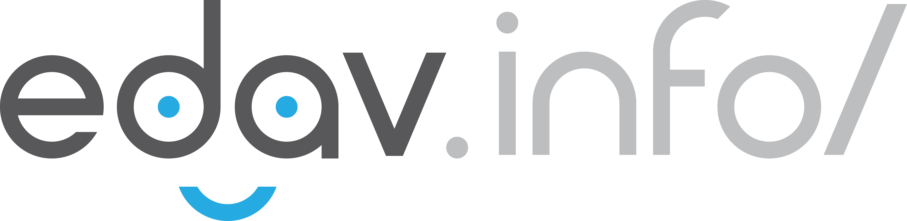

--- 
title: "edav.info/"
author: "Zach Bogart, Joyce Robbins"
date: "`r Sys.Date()`"
site: bookdown::bookdown_site
documentclass: book
#bibliography: [book.bib]
#biblio-style: apalike
link-citations: yes
github-repo: "jtr13/EDAV"
url: 'https://edav.info/'
description: "This resource is a collaborative collection of resources designed to help students succeed in GR5702 Exploratory Data Analysis and Visualization, a course offered at Columbia University. While the course lectures and textbook focus on theoretical issues, this resource, in contrast, provides coding tips and examples to assist students as they create their own analyses and visualizations. It is our hope that students will contribute to edav.info and it will grow with the course."
cover-image: "images/edav_link_logo.png"
---

```{r, include=FALSE}
knitr::opts_chunk$set(cache = TRUE)
```


# Welcome {-}

<center>

</center>

## Everything you need for Exploratory Data Analysis & Visualization

This resource has everything you need and more to be successful with R, this EDAV course, and beyond. Let's get started!

With this resource, we try to give you a **curated collection of tools and references** that will make it easier to learn how to work with data in R. 

In addition, we include sections on **basic chart types/tools** so you can learn by doing.

There are also **several walkthroughs** where we work with data and discuss problems as well as some tips/tricks that will help you.

We hope this resource serves you well!

This resource is specifically tailored to the GR5702 Exploratory Data Analysis and Visualization course offered at [Columbia University](https://www.columbia.edu/){target="_blank"}. However, anyone interested in working with data in R will benefit from perusing these pages. Happy coding!

## Contact

Zach Bogart: 
[Website](https://zachbogart.com/){target="_blank"}
/
[Twitter](https://twitter.com/zachbogart){target="_blank"}
/
[GitHub](https://github.com/zachbogart){target="_blank"}

Joyce Robbins: 
[Columbia Profile](http://stat.columbia.edu/department-directory/name/joyce-robbins/){target="_blank"}
/
[GitHub](https://github.com/jtr13){target="_blank"}

<!-- License -->
## License

<a rel="license" href="http://creativecommons.org/licenses/by-sa/4.0/" target="_blank"></a><br />This work is licensed under a <a rel="license" href="http://creativecommons.org/licenses/by-sa/4.0/" target="_blank">Creative Commons Attribution-ShareAlike 4.0 International License</a>.

<!-- Colophon -->
## Colophon

The EDAV Logo, the url/404 banners, and associated chapter icon designs are designed by Zach Bogart and published with permission. The url and 404 banners have been adapted into a typeface called [Koji](https://zachbogart.com/koji){target="_blank"}. Selected chapter icons can be accessed/purchased at [The Noun Project](https://thenounproject.com/zachbogart/){target="_blank"}. Please attribute the creator if using them for external purposes (see [their icon attribution guidelines](https://thenounproject.zendesk.com/hc/en-us/articles/200509928-How-do-I-give-creators-credit-in-my-work-){target="_blank"} for more information). 

<!-- Adding these nonvisible image files here to trick bookdown into copying them into the images folder -->





